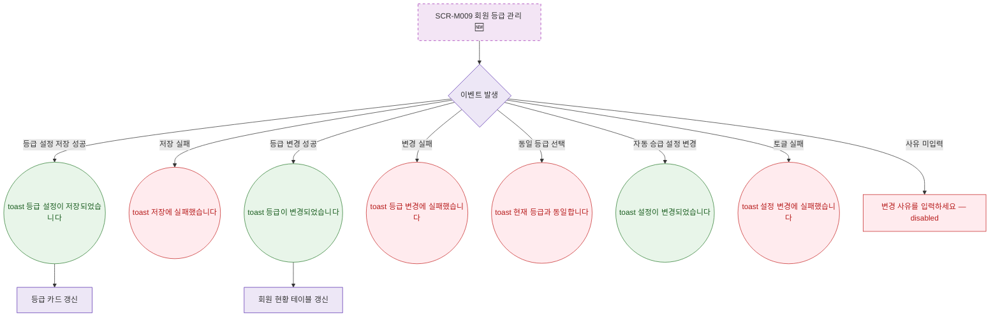

## 1. 목적

SCR-M009에서 발생하는 모든 토스트/피드백 조건을 명세한다. 🆕 미구현 기능.

## 2. 트리거/전제조건

- SCR-M009 각 액션 수행 시

## 3. 다이어그램

## 4. 엣지 설명

| 출발 | 도착 | 조건 | |---------|------|------|------| | | 이벤트 | toast | 등급 설정 저장 성공 | | | 이벤트 | toast | 등급 변경 성공 | | | 이벤트 | toast | 동일 등급 | | | 이벤트 | 필드 에러 | 사유 미입력 |
