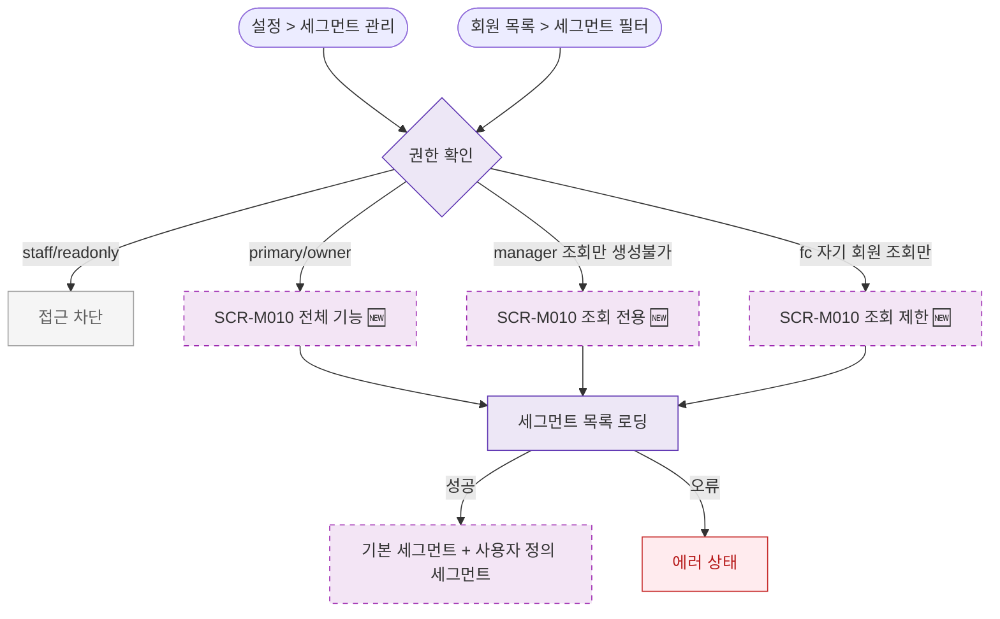

## 1. 목적

SCR-M010 회원 세그먼트 관리 화면 진입 경로를 명세한다. 🆕 미구현 기능.

## 2. 트리거/전제조건

- 사용자 로그인 상태

## 3. 다이어그램

## 4. 엣지 설명

| 출발 | 도착 | 조건 | |---------|------|------|------| | | 권한 확인 | 접근 차단 | staff/readonly | | | 권한 확인 | 조회 제한 | fc | | | 권한 확인 | 조회 전용 | manager | | | 권한 확인 | 전체 기능 | primary/owner |
