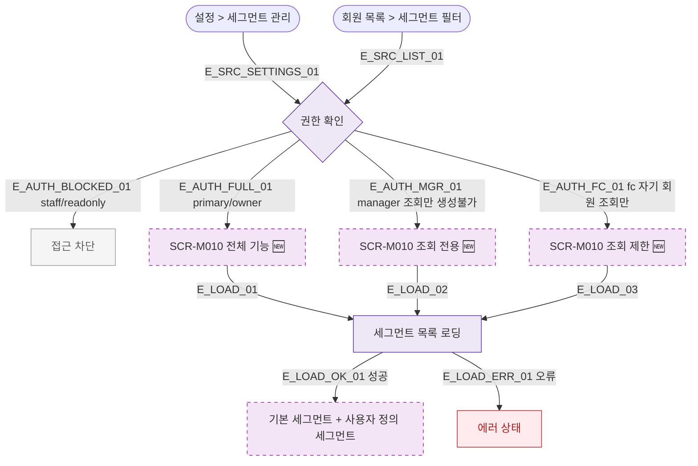

## 1. 목적

SCR-M010 회원 세그먼트 관리 화면 진입 경로를 명세한다. 🆕 미구현 기능.

## 2. 트리거/전제조건

- 사용자 로그인 상태

## 3. 다이어그램

## 4. 엣지 설명

| 엣지 ID | 출발 | 도착 | 조건 |
|---------|------|------|------|
| E_AUTH_BLOCKED_01 | 권한 확인 | 접근 차단 | staff/readonly |
| E_AUTH_FC_01 | 권한 확인 | 조회 제한 | fc |
| E_AUTH_MGR_01 | 권한 확인 | 조회 전용 | manager |
| E_AUTH_FULL_01 | 권한 확인 | 전체 기능 | primary/owner |

## 5. TC 후보

| TC ID | 타입 | Given | When | Then |
|-------|------|-------|------|------|
| TC-M010-F1-01 | positive | owner | 설정 > 세그먼트 관리 | 전체 기능 진입 |
| TC-M010-F1-02 | positive | manager | 접근 | 조회 전용 |
| TC-M010-F1-03 | positive | fc | 접근 | 자기 회원 조회 제한 |
| TC-M010-F1-04 | negative | staff | 접근 | 접근 차단 |
| TC-M010-F1-05 | negative | readonly | 접근 | 접근 차단 |
