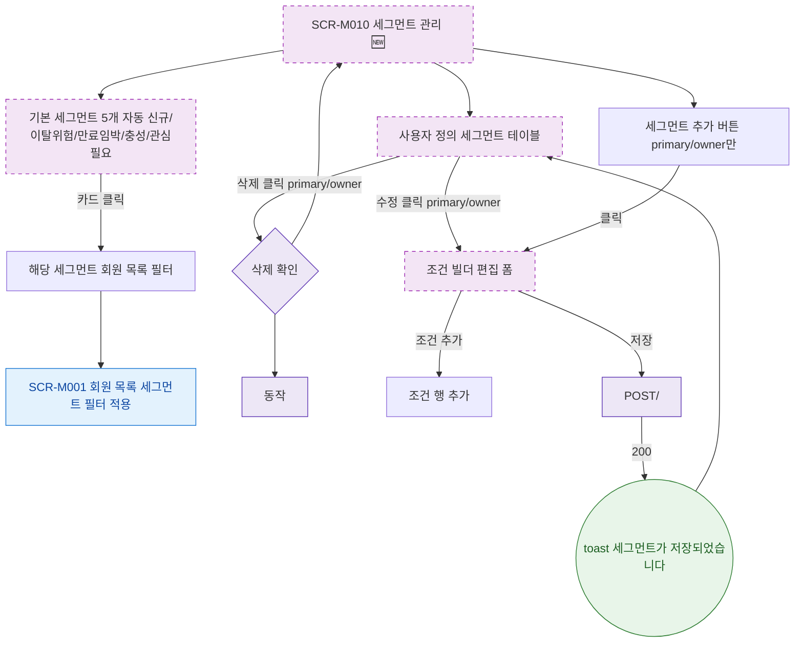

## 1. 목적

SCR-M010의 Happy Path — 기본/사용자 정의 세그먼트 조회 및 생성 흐름을 명세한다. 🆕 미구현 기능.

## 2. 트리거/전제조건

- SCR-M010 진입 완료

## 3. 다이어그램

## 4. 엣지 설명

| 출발 | 도착 | 조건 | |---------|------|------|------| | | 기본 세그먼트 카드 | 회원 목록 필터 | 클릭 | | | 추가 버튼 | 조건 빌더 | primary/owner 클릭 | | | 수정 클릭 | 조건 빌더 | primary/owner | | | 조건 빌더 | POST/PUT API | 저장 | | | API | toast | 200 |
