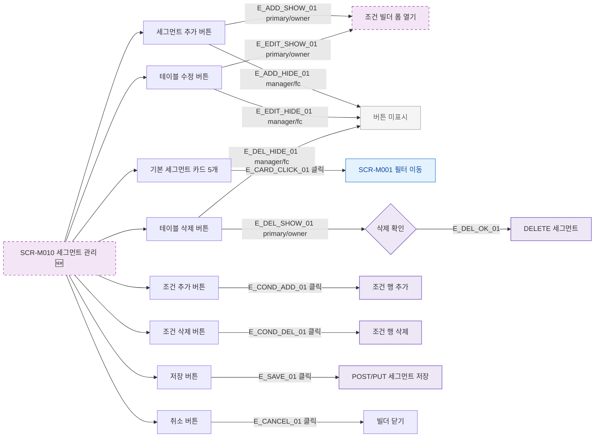

## 1. 목적

SCR-M010의 모든 버튼과 인터랙션 동작을 명세한다. 🆕 미구현 기능.

## 2. 트리거/전제조건

- SCR-M010 렌더링 완료

## 3. 다이어그램

## 4. 엣지 설명

| 엣지 ID | 출발 | 도착 | 조건 |
|---------|------|------|------|
| E_ADD_SHOW_01 | 추가 버튼 | 빌더 폼 | primary/owner |
| E_ADD_HIDE_01 | 추가 버튼 | 미표시 | manager/fc |
| E_CARD_CLICK_01 | 기본 카드 | SCR-M001 | 클릭 |
| E_SAVE_01 | 저장 버튼 | POST/PUT API | 클릭 |
| E_DEL_OK_01 | 삭제 확인 | DELETE API | 확인 |

## 5. TC 후보

| TC ID | 타입 | Given | When | Then |
|-------|------|-------|------|------|
| TC-M010-F3-01 | positive | owner | 추가 버튼 클릭 | 조건 빌더 표시 |
| TC-M010-F3-02 | negative | manager | 추가 버튼 | 미표시 |
| TC-M010-F3-03 | positive | 기본 카드 | 클릭 | 회원 목록 필터 이동 |
| TC-M010-F3-04 | positive | 조건 추가 버튼 | 클릭 | 조건 행 추가 |
| TC-M010-F3-05 | positive | 삭제 확인 | 확인 | 세그먼트 삭제 |
