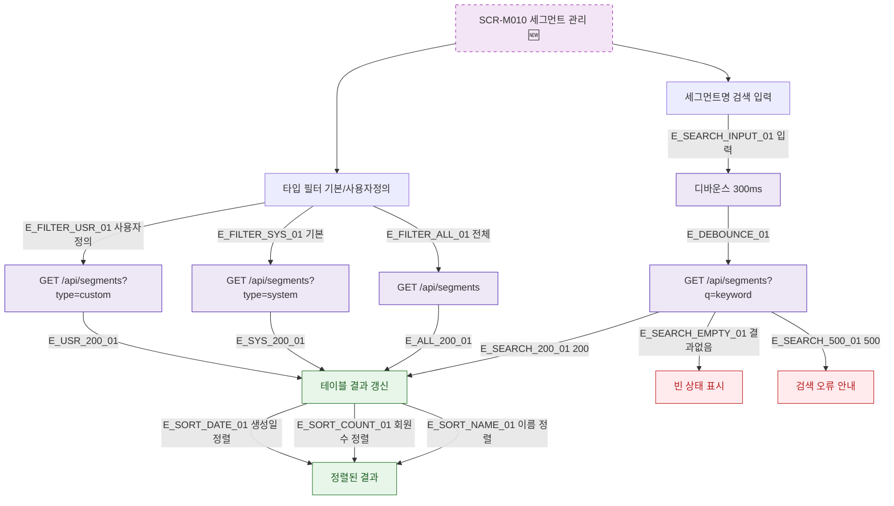

## 1. 목적

SCR-M010의 세그먼트 검색 및 필터 조건 입력 흐름을 명세한다. 🆕 미구현 기능.

## 2. 트리거/전제조건

- SCR-M010 렌더링 완료
- 사용자 정의 세그먼트 테이블 표시 상태

## 3. 다이어그램

## 4. 엣지 설명

| 엣지 ID | 출발 | 도착 | 조건 |
|---------|------|------|------|
| E_SEARCH_INPUT_01 | 검색 입력 | 디바운스 | 키 입력 |
| E_DEBOUNCE_01 | 디바운스 | API 호출 | 300ms 후 |
| E_SEARCH_200_01 | 검색 API | 테이블 갱신 | 200 |
| E_SEARCH_EMPTY_01 | 검색 API | 빈 상태 | 결과 없음 |
| E_FILTER_USR_01 | 타입 필터 | API | 사용자정의 선택 |

## 5. TC 후보

| TC ID | 타입 | Given | When | Then |
|-------|------|-------|------|------|
| TC-M010-F4-01 | positive | 검색어 입력 | 300ms 후 | API 호출, 결과 갱신 |
| TC-M010-F4-02 | positive | 결과없는 키워드 | 검색 | 빈 상태 표시 |
| TC-M010-F4-03 | positive | 타입=기본 필터 | 선택 | 기본 세그먼트만 표시 |
| TC-M010-F4-04 | positive | 타입=사용자정의 | 선택 | 사용자정의만 표시 |
| TC-M010-F4-05 | positive | 이름 컬럼 | 클릭 | 오름차순/내림차순 정렬 |
