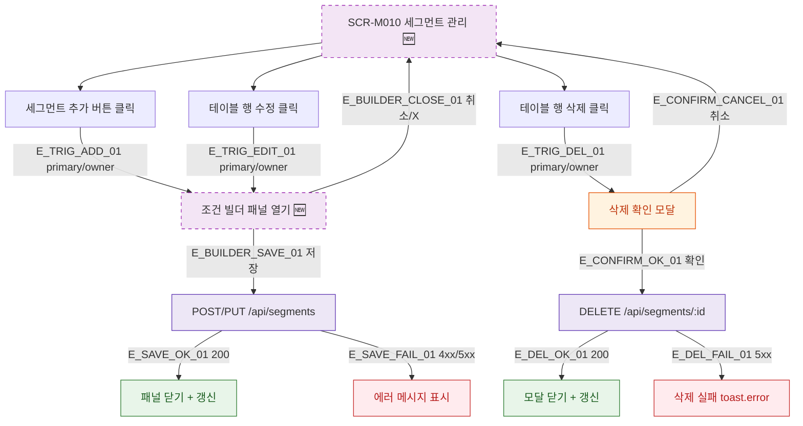

## 1. 목적

SCR-M010에서 모달/패널이 열리는 트리거 조건을 명세한다. 🆕 미구현 기능.

## 2. 트리거/전제조건

- SCR-M010 렌더링 완료

## 3. 다이어그램

## 4. 엣지 설명

| 엣지 ID | 출발 | 도착 | 조건 |
|---------|------|------|------|
| E_TRIG_ADD_01 | 추가 버튼 | 빌더 패널 | primary/owner |
| E_TRIG_EDIT_01 | 수정 클릭 | 빌더 패널 | primary/owner |
| E_TRIG_DEL_01 | 삭제 클릭 | 삭제 확인 모달 | primary/owner |
| E_BUILDER_SAVE_01 | 빌더 패널 | API 저장 | 저장 클릭 |
| E_CONFIRM_OK_01 | 삭제 확인 | DELETE API | 확인 클릭 |

## 5. TC 후보

| TC ID | 타입 | Given | When | Then |
|-------|------|-------|------|------|
| TC-M010-F5-01 | positive | owner | 추가 버튼 클릭 | 조건 빌더 패널 열림 |
| TC-M010-F5-02 | positive | owner | 수정 클릭 | 기존 조건 로드된 빌더 열림 |
| TC-M010-F5-03 | positive | owner | 삭제 클릭 | 삭제 확인 모달 열림 |
| TC-M010-F5-04 | positive | 빌더 저장 성공 | 저장 클릭 | 패널 닫힘 + 테이블 갱신 |
| TC-M010-F5-05 | positive | 삭제 확인 | 취소 클릭 | 모달 닫힘, 변경 없음 |
