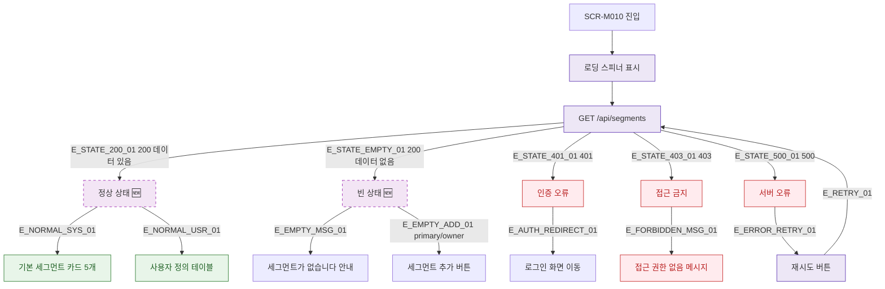

## 1. 목적

SCR-M010의 로딩/빈상태/에러/정상 등 각 UI 상태 분기를 명세한다. 🆕 미구현 기능.

## 2. 트리거/전제조건

- SCR-M010 진입 시 API 응답 상태에 따라 분기

## 3. 다이어그램

## 4. 엣지 설명

| 엣지 ID | 출발 | 도착 | 조건 |
|---------|------|------|------|
| E_STATE_200_01 | API | 정상 상태 | 200 + 데이터 |
| E_STATE_EMPTY_01 | API | 빈 상태 | 200 + 빈 배열 |
| E_STATE_401_01 | API | 인증 오류 | 401 |
| E_STATE_403_01 | API | 접근 금지 | 403 |
| E_STATE_500_01 | API | 서버 오류 | 500 |
| E_ERROR_RETRY_01 | 서버 오류 | 재시도 버튼 | 오류 상태 |

## 5. TC 후보

| TC ID | 타입 | Given | When | Then |
|-------|------|-------|------|------|
| TC-M010-F6-01 | positive | API 200 + 데이터 | 화면 진입 | 카드+테이블 정상 표시 |
| TC-M010-F6-02 | positive | API 200 + 빈배열 | 화면 진입 | 빈 상태 안내 표시 |
| TC-M010-F6-03 | negative | API 401 | 화면 진입 | 로그인 화면 이동 |
| TC-M010-F6-04 | negative | API 403 | 화면 진입 | 접근 권한 없음 메시지 |
| TC-M010-F6-05 | exception | API 500 | 화면 진입 | 재시도 버튼 표시 |
