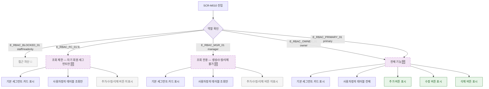

## 1. 목적

SCR-M010에서 역할별 접근 권한 분기를 명세한다. 🆕 미구현 기능.

## 2. 트리거/전제조건

- 사용자 로그인 상태
- SCR-M010 진입 시도

## 3. 다이어그램

## 4. 엣지 설명

| 엣지 ID | 출발 | 도착 | 조건 |
|---------|------|------|------|
| E_RBAC_BLOCKED_01 | 역할 확인 | 접근 차단 | staff/readonly |
| E_RBAC_FC_01 | 역할 확인 | 조회 제한 | fc |
| E_RBAC_MGR_01 | 역할 확인 | 조회 전용 | manager |
| E_RBAC_OWNER_01 | 역할 확인 | 전체 기능 | owner |
| E_RBAC_PRIMARY_01 | 역할 확인 | 전체 기능 | primary |

## 5. TC 후보

| TC ID | 타입 | Given | When | Then |
|-------|------|-------|------|------|
| TC-M010-F7-01 | positive | primary | 진입 | 추가/수정/삭제 버튼 모두 표시 |
| TC-M010-F7-02 | positive | owner | 진입 | 추가/수정/삭제 버튼 모두 표시 |
| TC-M010-F7-03 | positive | manager | 진입 | 조회만, 버튼 미표시 |
| TC-M010-F7-04 | positive | fc | 진입 | 자기 회원 세그먼트 조회만 |
| TC-M010-F7-05 | negative | staff | 진입 | 접근 차단 |
