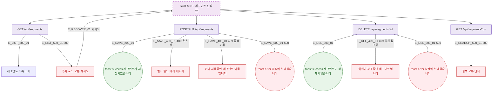

## 1. 목적

SCR-M010의 에러 코드별 분기와 복구 경로를 명세한다. 🆕 미구현 기능.

## 2. 트리거/전제조건

- SCR-M010 API 호출 실패 시

## 3. 다이어그램

## 4. 엣지 설명

| 엣지 ID | 출발 | 도착 | 조건 |
|---------|------|------|------|
| E_LIST_500_01 | 목록 API | 오류+재시도 | 500 |
| E_SAVE_400_01 | 저장 API | 필드 에러 | 400 유효성 |
| E_SAVE_409_01 | 저장 API | 중복 이름 에러 | 409 |
| E_SAVE_500_01 | 저장 API | toast.error | 500 |
| E_DEL_409_01 | 삭제 API | 참조 오류 | 409 |
| E_DEL_500_01 | 삭제 API | toast.error | 500 |

## 5. TC 후보

| TC ID | 타입 | Given | When | Then |
|-------|------|-------|------|------|
| TC-M010-F8-01 | exception | 목록 API 500 | 화면 로드 | 오류 안내 + 재시도 |
| TC-M010-F8-02 | negative | 유효성 오류 | 세그먼트 저장 | 빌더 필드 에러 |
| TC-M010-F8-03 | negative | 중복 이름 | 세그먼트 저장 | 409 에러 메시지 |
| TC-M010-F8-04 | exception | 저장 API 500 | 저장 시도 | toast.error |
| TC-M010-F8-05 | negative | 회원 참조중인 세그먼트 | 삭제 시도 | 409 에러 메시지 |
