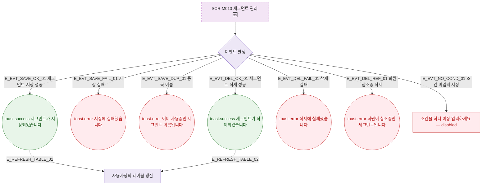

## 1. 목적

SCR-M010에서 발생하는 모든 토스트/피드백 조건을 명세한다. 🆕 미구현 기능.

## 2. 트리거/전제조건

- SCR-M010 각 액션 수행 시

## 3. 다이어그램

## 4. 엣지 설명

| 엣지 ID | 출발 | 도착 | 조건 |
|---------|------|------|------|
| E_EVT_SAVE_OK_01 | 이벤트 | toast.success | 저장 성공 |
| E_EVT_SAVE_FAIL_01 | 이벤트 | toast.error | 저장 실패 |
| E_EVT_SAVE_DUP_01 | 이벤트 | toast.error | 중복 이름 |
| E_EVT_DEL_OK_01 | 이벤트 | toast.success | 삭제 성공 |
| E_EVT_DEL_REF_01 | 이벤트 | toast.error | 회원 참조중 |
| E_EVT_NO_COND_01 | 이벤트 | 필드 에러 | 조건 미입력 |

## 5. TC 후보

| TC ID | 타입 | Given | When | Then |
|-------|------|-------|------|------|
| TC-M010-F9-01 | positive | 유효 조건 입력 | 저장 성공 | toast.success, 테이블 갱신 |
| TC-M010-F9-02 | exception | 저장 API 실패 | 저장 시도 | toast.error |
| TC-M010-F9-03 | negative | 중복 세그먼트 이름 | 저장 시도 | toast.error 중복 |
| TC-M010-F9-04 | positive | 세그먼트 삭제 성공 | 확인 클릭 | toast.success, 테이블 갱신 |
| TC-M010-F9-05 | negative | 조건 미입력 | 저장 버튼 | disabled 상태 |
