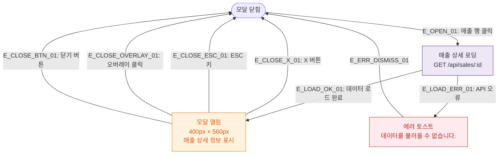

## 1. 목적
DLG-S001 매출상세 모달의 열기/닫기/파기 생명주기를 표현한다.

## 2. 전제조건
- SCR-S001 매출현황 화면에서 행 클릭

## 3. 다이어그램

## 4. 엣지 설명

| 엣지 ID | 출발 | 도착 | 설명 |
|---------|------|------|------|
| E_OPEN_01 | CLOSED | LOADING | 매출 행 클릭 → 데이터 로드 |
| E_LOAD_OK_01 | LOADING | OPEN | 로드 성공 → 모달 표시 |
| E_LOAD_ERR_01 | LOADING | ERR_TOAST | 로드 실패 → 에러 토스트 |
| E_CLOSE_X_01 | OPEN | CLOSED | X 버튼 닫기 |
| E_CLOSE_ESC_01 | OPEN | CLOSED | ESC 키 닫기 |
| E_CLOSE_OVERLAY_01 | OPEN | CLOSED | 오버레이 클릭 닫기 |

## 5. TC 후보

| TC ID | 타입 | Given | When | Then |
|-------|------|-------|------|------|
| TC-S001-DLG001-M1-01 | positive | 매출현황 목록 | 매출 행 클릭 | DLG-S001 열림, 상세 데이터 표시 |
| TC-S001-DLG001-M1-02 | positive | DLG-S001 열림 | ESC 키 | 모달 닫힘 |
| TC-S001-DLG001-M1-03 | exception | 행 클릭 | API 오류 | 에러 토스트, 모달 미열림 |
