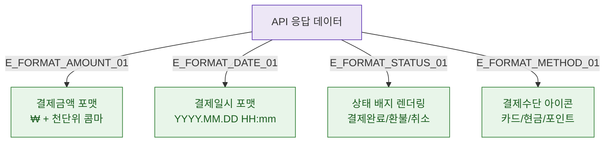

## 1. 목적
DLG-S001은 조회 전용 모달이므로 필드 검증 없음. 데이터 포맷 표시 규칙을 표현한다.

## 2. 전제조건
- DLG-S001 열림 상태

## 3. 다이어그램

## 4. 엣지 설명

| 엣지 ID | 출발 | 도착 | 설명 |
|---------|------|------|------|
| E_FORMAT_AMOUNT_01 | DATA_IN | FORMAT_AMOUNT | 금액 포맷 처리 |
| E_FORMAT_DATE_01 | DATA_IN | FORMAT_DATE | 날짜 포맷 처리 |
| E_FORMAT_STATUS_01 | DATA_IN | FORMAT_STATUS | 상태 배지 렌더링 |
| E_FORMAT_METHOD_01 | DATA_IN | FORMAT_METHOD | 결제수단 아이콘 |

## 5. TC 후보

| TC ID | 타입 | Given | When | Then |
|-------|------|-------|------|------|
| TC-S001-DLG001-M2-01 | positive | 매출 상세 데이터 | 모달 렌더링 | 금액 ₩ 포맷, 날짜 YYYY.MM.DD HH:mm |
