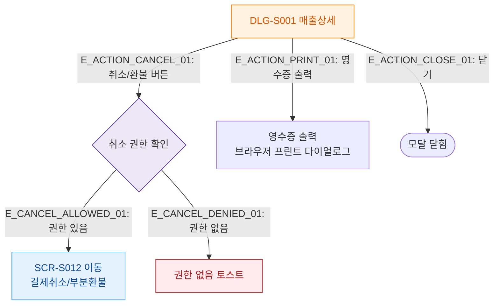

## 1. 목적
DLG-S001에서 액션 버튼 클릭 후 결과 분기를 표현한다.

## 2. 전제조건
- DLG-S001 열림 상태

## 3. 다이어그램

## 4. 엣지 설명

| 엣지 ID | 출발 | 도착 | 설명 |
|---------|------|------|------|
| E_ACTION_CANCEL_01 | DLG_S001 | AUTH_CANCEL | 취소/환불 버튼 → 권한 확인 |
| E_CANCEL_ALLOWED_01 | AUTH_CANCEL | GOTO_S012 | 권한 있음 → SCR-S012 이동 |
| E_CANCEL_DENIED_01 | AUTH_CANCEL | NO_AUTH_TOAST | 권한 없음 → 토스트 |
| E_ACTION_PRINT_01 | DLG_S001 | PRINT_RECEIPT | 영수증 출력 |

## 5. TC 후보

| TC ID | 타입 | Given | When | Then |
|-------|------|-------|------|------|
| TC-S001-DLG001-M3-01 | positive | manager 로그인, 취소가능 건 | 취소/환불 버튼 | SCR-S012로 이동 |
| TC-S001-DLG001-M3-02 | negative | trainer 로그인 | 취소/환불 버튼 | 권한 없음 토스트 |
