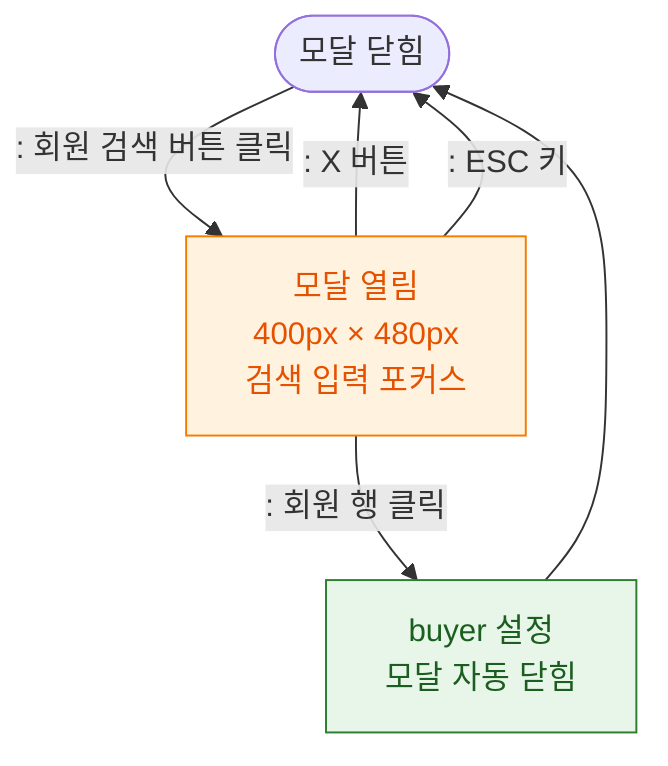

## 1. 목적
DLG-S002 구매자검색 모달의 열기/닫기 생명주기를 표현한다.

## 2. 전제조건
- SCR-S002 POS 판매 화면에서 회원 검색 버튼 클릭

## 3. 다이어그램

## 4. 엣지 설명

| 출발 | 도착 | 설명 | |---------|------|------|------| | | CLOSED | OPEN | 회원 검색 버튼 클릭 | | | OPEN | SET_BUYER | 회원 선택 → buyer 설정 | | | OPEN | CLOSED | X 버튼 닫기 | | | OPEN | CLOSED | ESC 닫기 |
