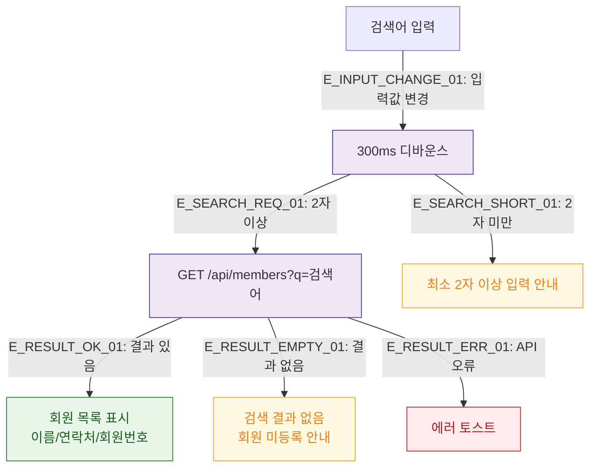

## 1. 목적
DLG-S002의 검색 입력 필드 검증 및 실시간 검색 흐름을 표현한다.

## 2. 전제조건
- DLG-S002 열림 상태

## 3. 다이어그램

## 4. 엣지 설명

| 엣지 ID | 출발 | 도착 | 설명 |
|---------|------|------|------|
| E_INPUT_CHANGE_01 | INPUT | DEBOUNCE | 입력 변경 → 디바운스 |
| E_SEARCH_REQ_01 | DEBOUNCE | SEARCH_API | 2자 이상 → API 호출 |
| E_SEARCH_SHORT_01 | DEBOUNCE | HINT | 2자 미만 → 안내 |
| E_RESULT_OK_01 | SEARCH_API | RESULT_LIST | 결과 목록 표시 |
| E_RESULT_EMPTY_01 | SEARCH_API | EMPTY | 결과 없음 |

## 5. TC 후보

| TC ID | 타입 | Given | When | Then |
|-------|------|-------|------|------|
| TC-S002-DLG002-M2-01 | positive | 검색창 | 2자 이상 입력 | 300ms 후 API 호출, 목록 표시 |
| TC-S002-DLG002-M2-02 | negative | 검색창 | 1자 입력 | 최소 2자 안내 |
