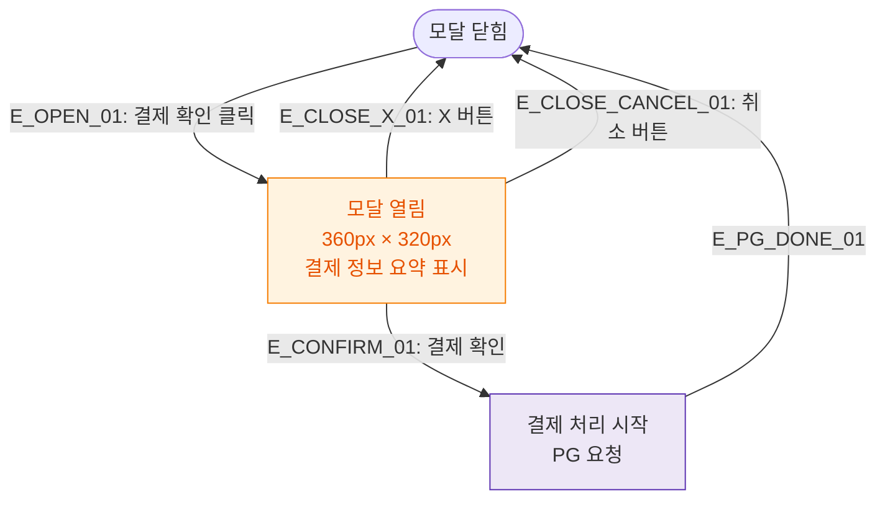

## 1. 목적
DLG-S003 결제확인 모달의 열기/닫기 생명주기를 표현한다.

## 2. 전제조건
- SCR-S003 결제처리 화면에서 결제 확인 버튼 클릭

## 3. 다이어그램

## 4. 엣지 설명

| 엣지 ID | 출발 | 도착 | 설명 |
|---------|------|------|------|
| E_OPEN_01 | CLOSED | OPEN | 결제 확인 버튼 클릭 |
| E_CONFIRM_01 | OPEN | PROCESS | 결제 확인 → PG 요청 |
| E_CLOSE_X_01 | OPEN | CLOSED | X 버튼 닫기 |
| E_CLOSE_CANCEL_01 | OPEN | CLOSED | 취소 버튼 닫기 |

## 5. TC 후보

| TC ID | 타입 | Given | When | Then |
|-------|------|-------|------|------|
| TC-S003-DLG003-M1-01 | positive | 결제처리 화면 | 결제 확인 클릭 | DLG-S003 열림, 결제 정보 표시 |
| TC-S003-DLG003-M1-02 | positive | DLG-S003 열림 | 취소 버튼 | 모달 닫힘, 결제 미처리 |
