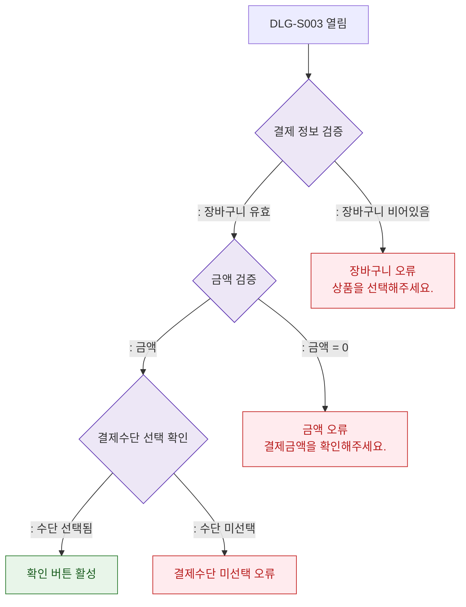

## 1. 목적
DLG-S003 결제확인 모달에서 결제 정보 유효성 검증 흐름을 표현한다.

## 2. 전제조건
- DLG-S003 열림 상태

## 3. 다이어그램

## 4. 엣지 설명

| 출발 | 도착 | 설명 | |---------|------|------|------| | | VALIDATE | AMOUNT_CHECK | 장바구니 유효 | | | VALIDATE | ERR_CART | 장바구니 빈 상태 | | | AMOUNT_CHECK | PAYMENT_CHECK | 금액 유효 | | | PAYMENT_CHECK | CONFIRM_READY | 결제수단 선택됨 |
