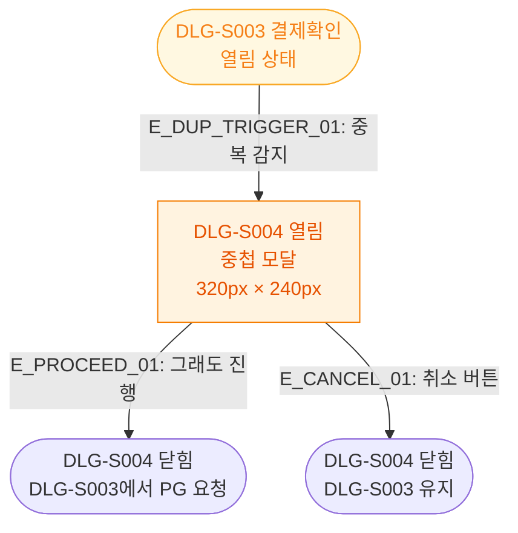

## 1. 목적
DLG-S004 중복결제경고 모달의 열기/닫기 생명주기를 표현한다. DLG-S003 위에 중첩 표시된다.

## 2. 전제조건
- DLG-S003에서 중복 결제 감지됨

## 3. 다이어그램

## 4. 엣지 설명

| 엣지 ID | 출발 | 도착 | 설명 |
|---------|------|------|------|
| E_DUP_TRIGGER_01 | DLG_S003 | OPEN | 중복 감지 → 경고 모달 |
| E_PROCEED_01 | OPEN | CLOSED_PROCEED | 진행 확인 → DLG 닫힘 |
| E_CANCEL_01 | OPEN | CLOSED_CANCEL | 취소 → DLG-S003 유지 |

## 5. TC 후보

| TC ID | 타입 | Given | When | Then |
|-------|------|-------|------|------|
| TC-S003-DLG004-M1-01 | positive | 중복 결제 감지 | DLG-S003 확인 | DLG-S004 중첩 표시 |
| TC-S003-DLG004-M1-02 | positive | DLG-S004 열림 | 취소 | DLG-S004만 닫힘, DLG-S003 유지 |
