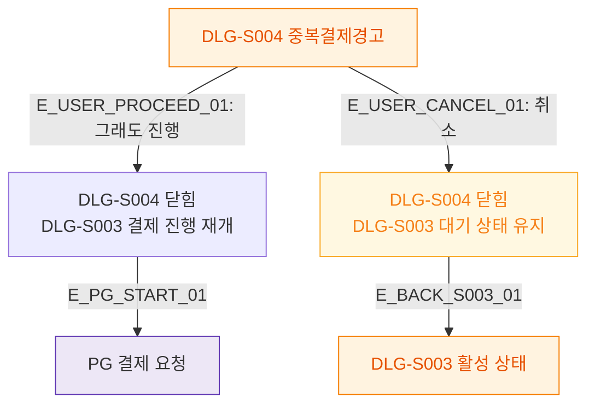

## 1. 목적
DLG-S004에서 사용자 선택에 따른 결과 분기를 표현한다.

## 2. 전제조건
- DLG-S004 열림 상태

## 3. 다이어그램

## 4. 엣지 설명

| 엣지 ID | 출발 | 도착 | 설명 |
|---------|------|------|------|
| E_USER_PROCEED_01 | DLG_S004 | PROCEED_RESULT | 진행 선택 → PG 요청 |
| E_USER_CANCEL_01 | DLG_S004 | CANCEL_RESULT | 취소 → DLG-S003 유지 |
| E_PG_START_01 | PROCEED_RESULT | PG_REQ | PG 결제 요청 시작 |

## 5. TC 후보

| TC ID | 타입 | Given | When | Then |
|-------|------|-------|------|------|
| TC-S003-DLG004-M3-01 | positive | DLG-S004 열림 | 그래도 진행 클릭 | DLG-S004 닫힘, PG 요청 |
| TC-S003-DLG004-M3-02 | positive | DLG-S004 열림 | 취소 클릭 | DLG-S004 닫힘, DLG-S003 유지 |
