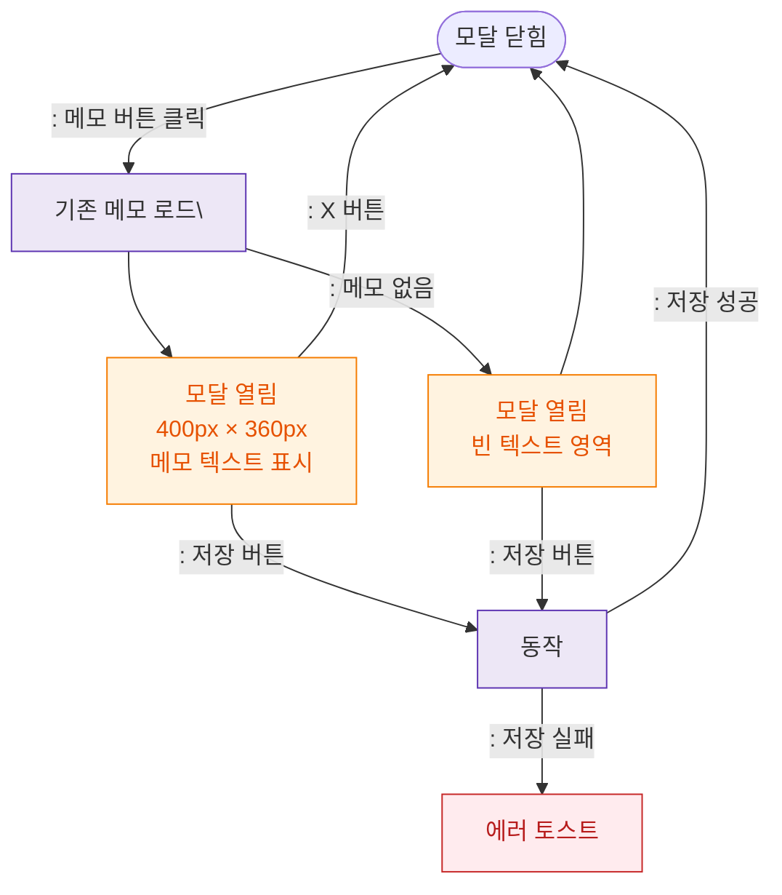

## 1. 목적
DLG-S005 메모편집 모달의 열기/닫기 생명주기를 표현한다.

## 2. 전제조건
- SCR-S008 미수금관리에서 메모 버튼 클릭

## 3. 다이어그램

## 4. 엣지 설명

| 출발 | 도착 | 설명 | |---------|------|------|------| | | CLOSED | LOAD | 메모 버튼 클릭 → 기존 메모 로드 | | | OPEN | SAVE | 저장 버튼 클릭 | | | SAVE | CLOSED | 저장 성공 → 닫힘 | | | SAVE | ERR_TOAST | 저장 실패 |
