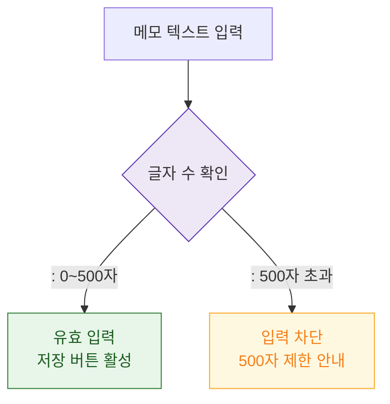

## 1. 목적
DLG-S005 메모 입력 필드 검증 규칙을 표현한다.

## 2. 전제조건
- DLG-S005 열림 상태

## 3. 다이어그램

## 4. 엣지 설명

| 출발 | 도착 | 설명 | |---------|------|------|------| | | CHAR_COUNT | VALID | 500자 이하 → 유효 | | | CHAR_COUNT | EXCEED | 500자 초과 → 차단 |
