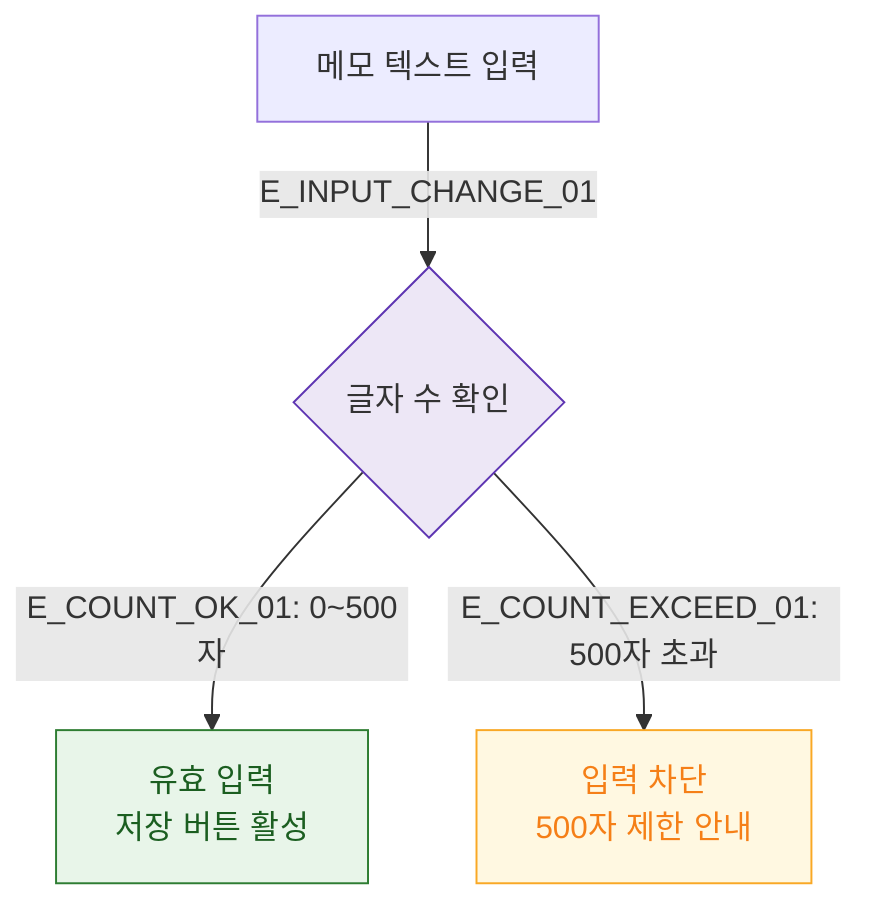

## 1. 목적
DLG-S005 메모 입력 필드 검증 규칙을 표현한다.

## 2. 전제조건
- DLG-S005 열림 상태

## 3. 다이어그램

## 4. 엣지 설명

| 엣지 ID | 출발 | 도착 | 설명 |
|---------|------|------|------|
| E_COUNT_OK_01 | CHAR_COUNT | VALID | 500자 이하 → 유효 |
| E_COUNT_EXCEED_01 | CHAR_COUNT | EXCEED | 500자 초과 → 차단 |

## 5. TC 후보

| TC ID | 타입 | Given | When | Then |
|-------|------|-------|------|------|
| TC-S008-DLG005-M2-01 | positive | 메모 입력창 | 499자 입력 | 저장 버튼 활성 |
| TC-S008-DLG005-M2-02 | negative | 메모 입력창 | 501자 입력 시도 | 입력 차단, 500자 안내 |
