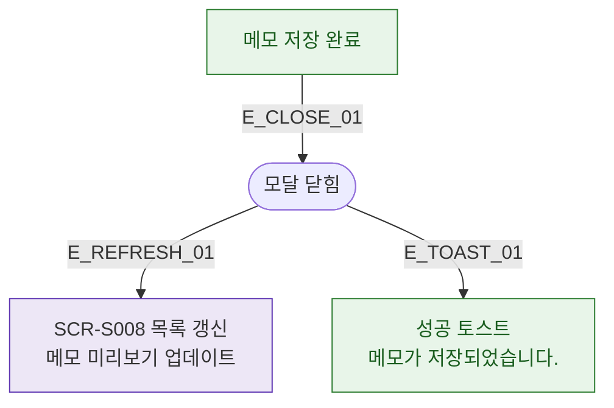

## 1. 목적
DLG-S005 저장 후 SCR-S008 목록 갱신 흐름을 표현한다.

## 2. 전제조건
- DLG-S005에서 저장 완료

## 3. 다이어그램

## 4. 엣지 설명

| 엣지 ID | 출발 | 도착 | 설명 |
|---------|------|------|------|
| E_CLOSE_01 | SAVE_OK | CLOSED | 저장 완료 → 닫힘 |
| E_REFRESH_01 | CLOSED | REFRESH | 목록 갱신 |
| E_TOAST_01 | CLOSED | SUCCESS_TOAST | 성공 토스트 |

## 5. TC 후보

| TC ID | 타입 | Given | When | Then |
|-------|------|-------|------|------|
| TC-S008-DLG005-M3-01 | positive | 메모 저장 완료 | 모달 닫힘 후 | SCR-S008 메모 미리보기 업데이트, 성공 토스트 |
