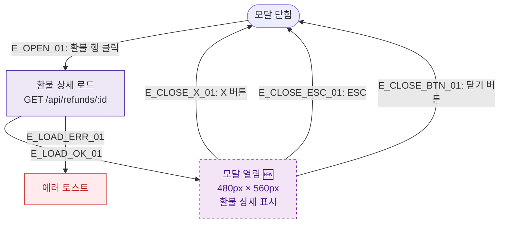

## 1. 목적
DLG-S006 환불상세 모달(🆕)의 열기/닫기 생명주기를 표현한다.

## 2. 전제조건
- SCR-S007 환불관리에서 환불 행 클릭

## 3. 다이어그램

## 4. 엣지 설명

| 엣지 ID | 출발 | 도착 | 설명 |
|---------|------|------|------|
| E_OPEN_01 | CLOSED | LOAD | 환불 행 클릭 → 로드 |
| E_LOAD_OK_01 | LOAD | OPEN | 로드 성공 → 모달 |
| E_LOAD_ERR_01 | LOAD | ERR_TOAST | 로드 실패 |
| E_CLOSE_X_01 | OPEN | CLOSED | X 버튼 닫기 |

## 5. TC 후보

| TC ID | 타입 | Given | When | Then |
|-------|------|-------|------|------|
| TC-S007-DLG006-M1-01 | positive | 환불관리 목록 | 환불 행 클릭 | DLG-S006 열림, 상세 정보 표시 |
| TC-S007-DLG006-M1-02 | exception | 행 클릭 | API 오류 | 에러 토스트, 모달 미열림 |
