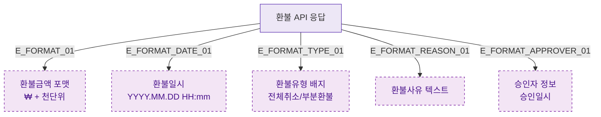

## 1. 목적
DLG-S006은 조회 전용 모달. 환불 데이터 표시 포맷 규칙을 표현한다.

## 2. 전제조건
- DLG-S006 열림 상태

## 3. 다이어그램

## 4. 엣지 설명

| 엣지 ID | 출발 | 도착 | 설명 |
|---------|------|------|------|
| E_FORMAT_01 | DATA | DISPLAY_AMOUNT | 환불금액 포맷 |
| E_FORMAT_TYPE_01 | DATA | DISPLAY_TYPE | 전체/부분 배지 |
| E_FORMAT_APPROVER_01 | DATA | DISPLAY_APPROVER | 승인자 정보 |

## 5. TC 후보

| TC ID | 타입 | Given | When | Then |
|-------|------|-------|------|------|
| TC-S007-DLG006-M2-01 | positive | 환불 상세 데이터 | 모달 렌더링 | 금액/일시/유형/사유/승인자 정상 표시 |
