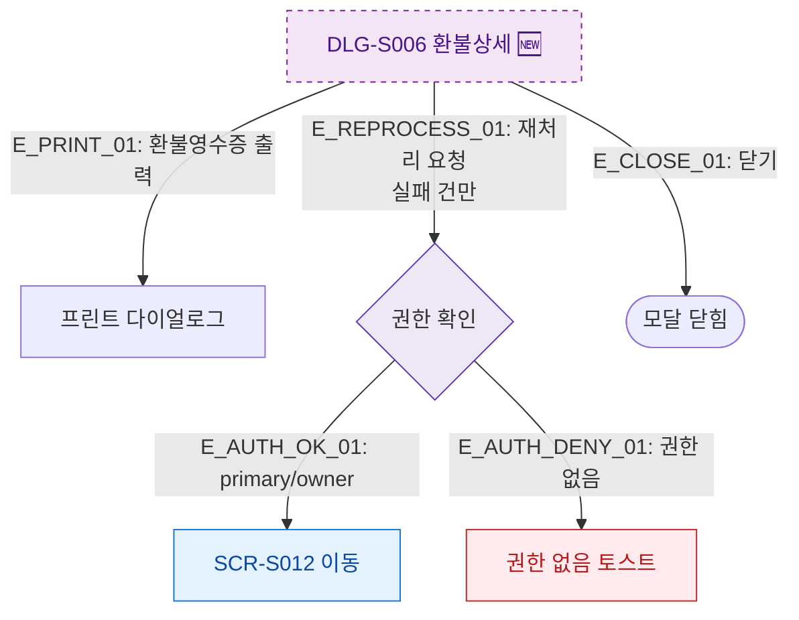

## 1. 목적
DLG-S006에서 추가 액션(재처리/영수증) 분기를 표현한다.

## 2. 전제조건
- DLG-S006 열림 상태

## 3. 다이어그램

## 4. 엣지 설명

| 엣지 ID | 출발 | 도착 | 설명 |
|---------|------|------|------|
| E_PRINT_01 | DLG_S006 | PRINT | 환불 영수증 출력 |
| E_REPROCESS_01 | DLG_S006 | AUTH_CHECK | 재처리 요청 → 권한 확인 |
| E_AUTH_OK_01 | AUTH_CHECK | GOTO_S012 | 권한 있음 → SCR-S012 |
| E_AUTH_DENY_01 | AUTH_CHECK | NO_AUTH | 권한 없음 토스트 |

## 5. TC 후보

| TC ID | 타입 | Given | When | Then |
|-------|------|-------|------|------|
| TC-S007-DLG006-M3-01 | positive | owner 로그인, 실패 환불 건 | 재처리 클릭 | SCR-S012로 이동 |
| TC-S007-DLG006-M3-02 | negative | manager 로그인 | 재처리 클릭 | 권한 없음 토스트 |
