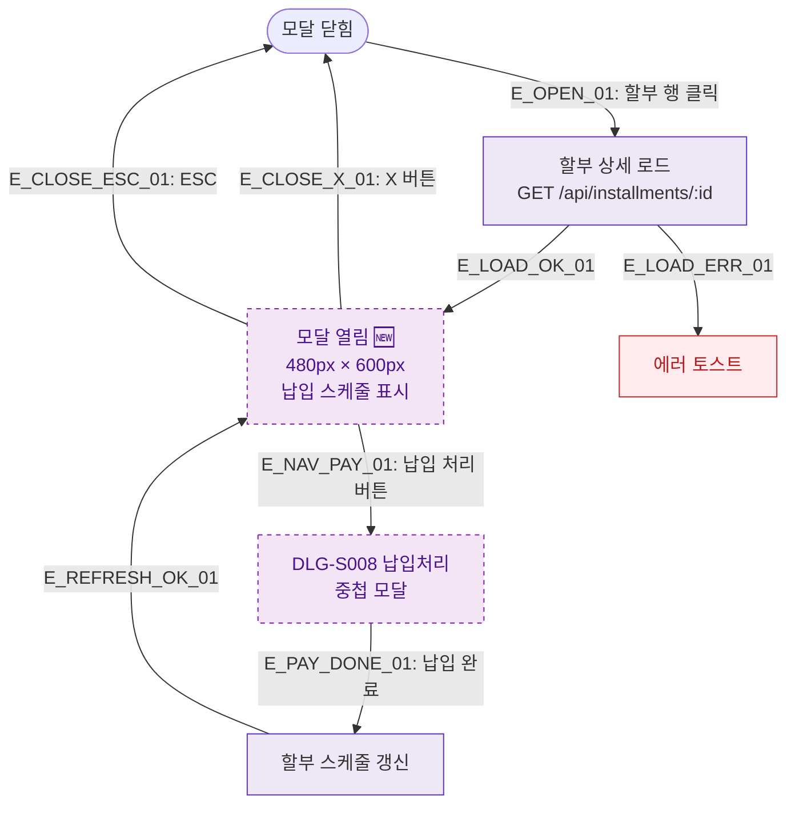

## 1. 목적
DLG-S007 할부상세 모달(🆕)의 열기/닫기 생명주기를 표현한다.

## 2. 전제조건
- SCR-S009 할부결제관리에서 할부 행 클릭

## 3. 다이어그램

## 4. 엣지 설명

| 엣지 ID | 출발 | 도착 | 설명 |
|---------|------|------|------|
| E_OPEN_01 | CLOSED | LOAD | 할부 행 클릭 → 로드 |
| E_LOAD_OK_01 | LOAD | OPEN | 로드 성공 |
| E_NAV_PAY_01 | OPEN | DLG_S008 | 납입 처리 버튼 → DLG-S008 |
| E_PAY_DONE_01 | DLG_S008 | REFRESH | 납입 완료 → 스케줄 갱신 |

## 5. TC 후보

| TC ID | 타입 | Given | When | Then |
|-------|------|-------|------|------|
| TC-S009-DLG007-M1-01 | positive | 할부 목록 | 행 클릭 | DLG-S007 열림, 납입 스케줄 표시 |
| TC-S009-DLG007-M1-02 | positive | DLG-S007 열림 | 납입 처리 클릭 | DLG-S008 중첩 표시 |
