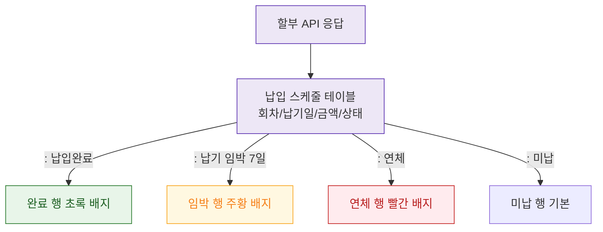

## 1. 목적
DLG-S007 납입 스케줄 표시 및 상태 포맷 규칙을 표현한다.

## 2. 전제조건
- DLG-S007 열림 상태

## 3. 다이어그램

## 4. 엣지 설명

| 출발 | 도착 | 설명 | |---------|------|------|------| | | DATA | SCHEDULE | 스케줄 테이블 렌더링 | | | SCHEDULE | PAID_ROW | 완료 상태 초록 | | | SCHEDULE | OVERDUE_ROW | 연체 상태 빨강 |
