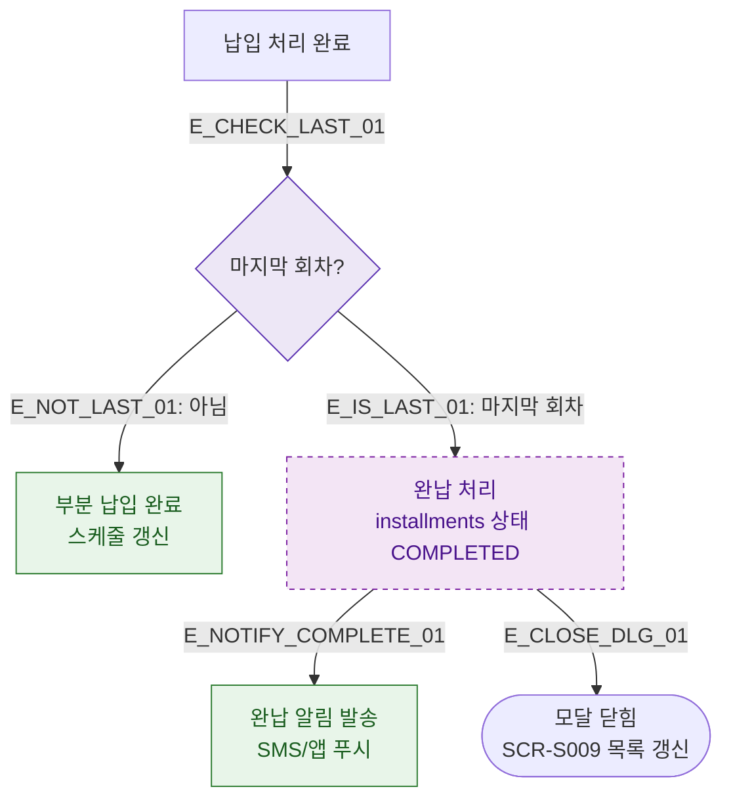

## 1. 목적
DLG-S007에서 마지막 회차 납입 완료 시 완납 처리 분기를 표현한다.

## 2. 전제조건
- DLG-S007에서 납입 처리 완료

## 3. 다이어그램

## 4. 엣지 설명

| 엣지 ID | 출발 | 도착 | 설명 |
|---------|------|------|------|
| E_CHECK_LAST_01 | PAY_DONE | LAST_CHECK | 마지막 회차 여부 확인 |
| E_NOT_LAST_01 | LAST_CHECK | PARTIAL_DONE | 중간 회차 납입 완료 |
| E_IS_LAST_01 | LAST_CHECK | FULL_DONE | 마지막 회차 → 완납 |
| E_NOTIFY_COMPLETE_01 | FULL_DONE | NOTIFY | 완납 알림 발송 |

## 5. TC 후보

| TC ID | 타입 | Given | When | Then |
|-------|------|-------|------|------|
| TC-S009-DLG007-M3-01 | positive | 중간 회차 | 납입 처리 완료 | 스케줄 갱신, 모달 유지 |
| TC-S009-DLG007-M3-02 | positive | 마지막 회차 | 납입 처리 완료 | 완납 처리, 알림 발송, 모달 닫힘 |
