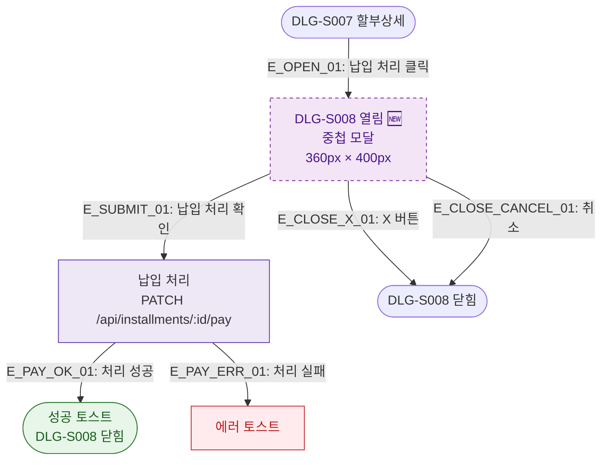

## 1. 목적
DLG-S008 납입처리 모달(🆕)의 열기/닫기 생명주기를 표현한다. DLG-S007 위에 중첩 표시된다.

## 2. 전제조건
- DLG-S007에서 납입 처리 버튼 클릭

## 3. 다이어그램

## 4. 엣지 설명

| 엣지 ID | 출발 | 도착 | 설명 |
|---------|------|------|------|
| E_OPEN_01 | DLG_S007 | OPEN | 납입 처리 버튼 클릭 |
| E_SUBMIT_01 | OPEN | PROCESS | 납입 확인 → API 호출 |
| E_PAY_OK_01 | PROCESS | SUCCESS_CLOSE | 처리 성공 → 닫힘 |
| E_PAY_ERR_01 | PROCESS | ERR_TOAST | 처리 실패 |

## 5. TC 후보

| TC ID | 타입 | Given | When | Then |
|-------|------|-------|------|------|
| TC-S009-DLG008-M1-01 | positive | DLG-S007 열림 | 납입 처리 클릭 | DLG-S008 중첩 표시 |
| TC-S009-DLG008-M1-02 | positive | DLG-S008 열림 | 납입 확인 | 처리 성공, 닫힘 |
