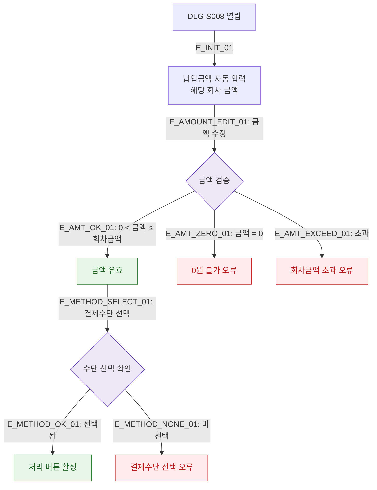

## 1. 목적
DLG-S008 납입 금액 및 결제수단 입력 검증 규칙을 표현한다.

## 2. 전제조건
- DLG-S008 열림 상태

## 3. 다이어그램

## 4. 엣지 설명

| 엣지 ID | 출발 | 도착 | 설명 |
|---------|------|------|------|
| E_INIT_01 | OPEN | PREFILL | 회차 금액 자동 입력 |
| E_AMT_OK_01 | AMOUNT_CHECK | AMT_VALID | 금액 유효 |
| E_AMT_EXCEED_01 | AMOUNT_CHECK | EXCEED_ERR | 회차 금액 초과 |
| E_METHOD_OK_01 | METHOD_CHECK | READY | 결제수단 선택 완료 |

## 5. TC 후보

| TC ID | 타입 | Given | When | Then |
|-------|------|-------|------|------|
| TC-S009-DLG008-M2-01 | positive | DLG-S008 열림 | 금액 자동 입력 확인 | 회차 금액 표시 |
| TC-S009-DLG008-M2-02 | negative | 금액 입력 | 0 입력 | 0원 불가 오류 |
| TC-S009-DLG008-M2-03 | negative | 금액 입력 | 회차 초과 금액 | 초과 오류 |
