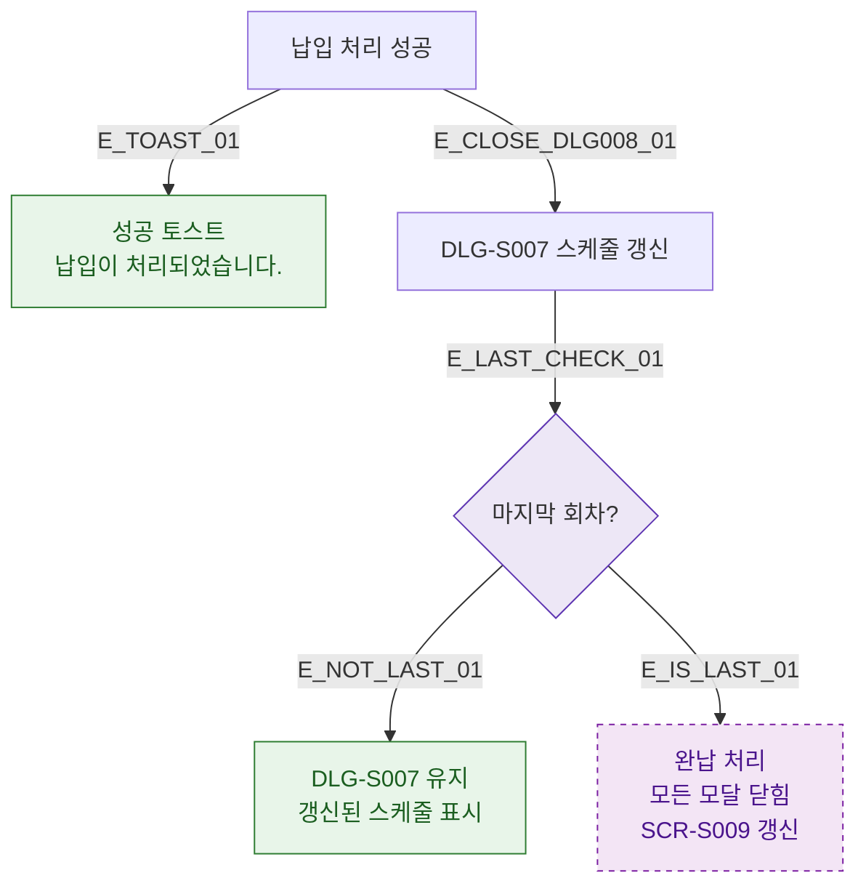

## 1. 목적
DLG-S008 납입 처리 후 결과 분기 및 DLG-S007 스케줄 갱신 흐름을 표현한다.

## 2. 전제조건
- DLG-S008에서 납입 처리 완료

## 3. 다이어그램

## 4. 엣지 설명

| 엣지 ID | 출발 | 도착 | 설명 |
|---------|------|------|------|
| E_TOAST_01 | PAY_OK | SUCCESS_TOAST | 납입 성공 토스트 |
| E_CLOSE_DLG008_01 | PAY_OK | DLG_S007_REFRESH | DLG-S007 스케줄 갱신 |
| E_IS_LAST_01 | LAST | COMPLETE | 마지막 회차 → 완납 |

## 5. TC 후보

| TC ID | 타입 | Given | When | Then |
|-------|------|-------|------|------|
| TC-S009-DLG008-M3-01 | positive | 3회차 중 2회차 납입 | 처리 완료 | DLG-S007 스케줄 갱신, DLG-S008 닫힘 |
| TC-S009-DLG008-M3-02 | positive | 마지막 회차 납입 | 처리 완료 | 완납 처리, 전체 모달 닫힘 |
