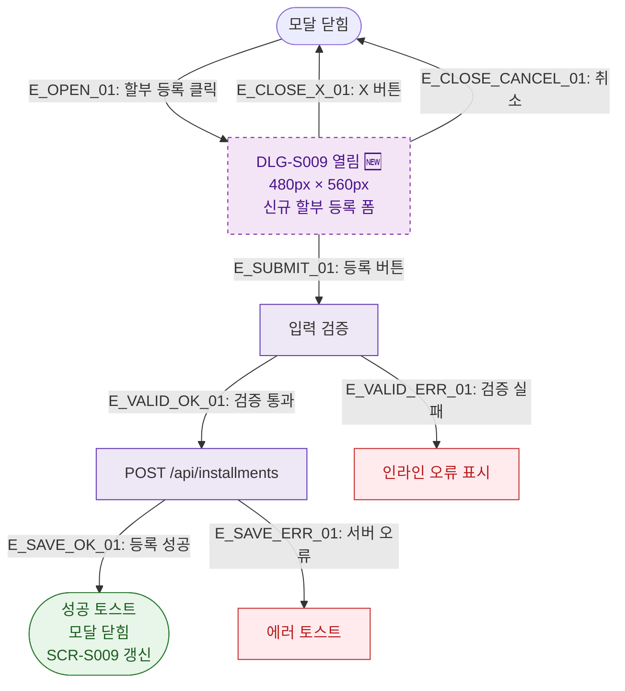

## 1. 목적
DLG-S009 할부등록 모달(🆕)의 열기/닫기 생명주기를 표현한다.

## 2. 전제조건
- SCR-S009 할부결제관리에서 할부 등록 버튼 클릭

## 3. 다이어그램

## 4. 엣지 설명

| 엣지 ID | 출발 | 도착 | 설명 |
|---------|------|------|------|
| E_OPEN_01 | CLOSED | OPEN | 할부 등록 버튼 클릭 |
| E_SUBMIT_01 | OPEN | VALIDATE | 등록 버튼 → 검증 |
| E_VALID_OK_01 | VALIDATE | SAVE | 검증 통과 → API |
| E_SAVE_OK_01 | SAVE | SUCCESS | 등록 성공 |

## 5. TC 후보

| TC ID | 타입 | Given | When | Then |
|-------|------|-------|------|------|
| TC-S009-DLG009-M1-01 | positive | 할부관리 화면 | 할부 등록 클릭 | DLG-S009 열림 |
| TC-S009-DLG009-M1-02 | positive | 폼 작성 완료 | 등록 버튼 | 성공 토스트, 모달 닫힘 |
