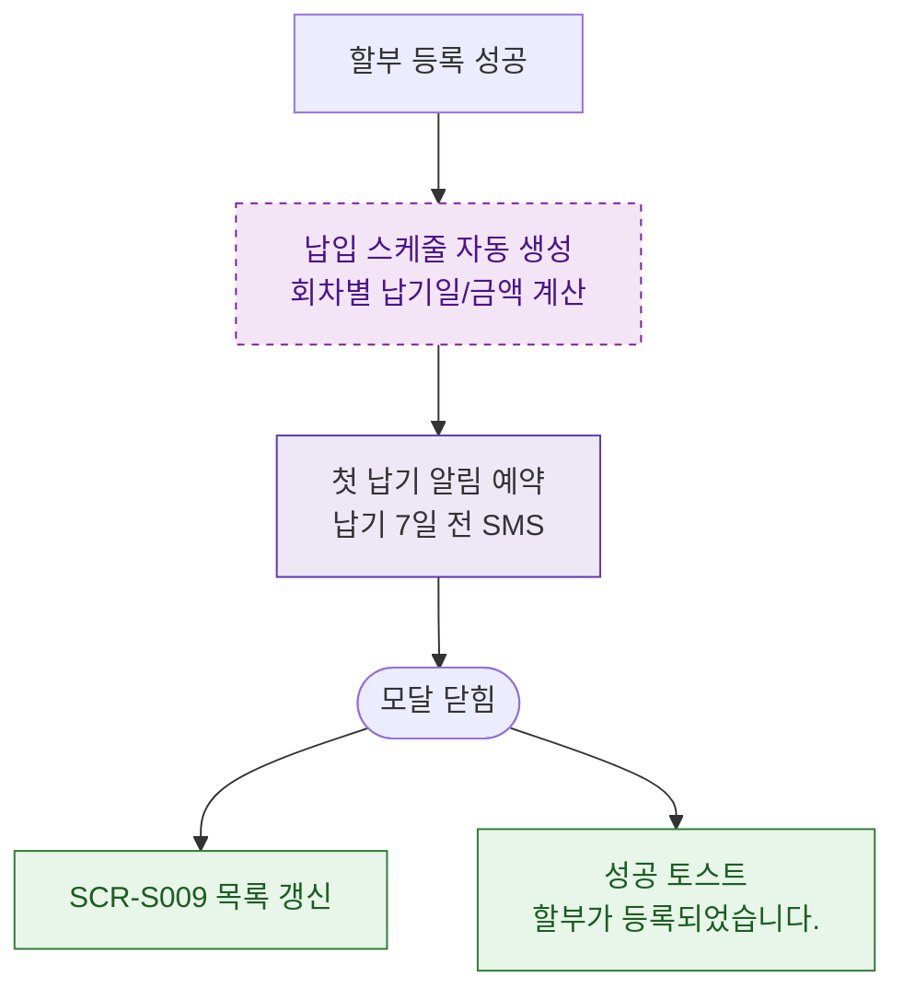

## 1. 목적
DLG-S009 등록 완료 후 SCR-S009 목록 갱신 및 첫 납기 알림 발송 흐름을 표현한다.

## 2. 전제조건
- DLG-S009 등록 성공

## 3. 다이어그램

## 4. 엣지 설명

| 출발 | 도착 | 설명 | |---------|------|------|------| | | SAVE_OK | SCHEDULE_GEN | 납입 스케줄 자동 생성 | | | SCHEDULE_GEN | NOTIFY | 첫 납기 알림 예약 | | | CLOSED | REFRESH | SCR-S009 목록 갱신 |
