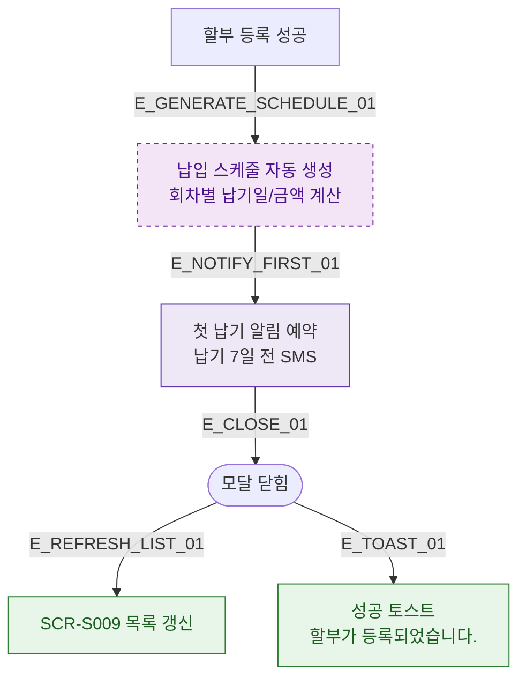

## 1. 목적
DLG-S009 등록 완료 후 SCR-S009 목록 갱신 및 첫 납기 알림 발송 흐름을 표현한다.

## 2. 전제조건
- DLG-S009 등록 성공

## 3. 다이어그램

## 4. 엣지 설명

| 엣지 ID | 출발 | 도착 | 설명 |
|---------|------|------|------|
| E_GENERATE_SCHEDULE_01 | SAVE_OK | SCHEDULE_GEN | 납입 스케줄 자동 생성 |
| E_NOTIFY_FIRST_01 | SCHEDULE_GEN | NOTIFY | 첫 납기 알림 예약 |
| E_REFRESH_LIST_01 | CLOSED | REFRESH | SCR-S009 목록 갱신 |

## 5. TC 후보

| TC ID | 타입 | Given | When | Then |
|-------|------|-------|------|------|
| TC-S009-DLG009-M3-01 | positive | 할부 등록 완료 | 모달 닫힘 후 | 스케줄 생성, 알림 예약, 목록 갱신 |
