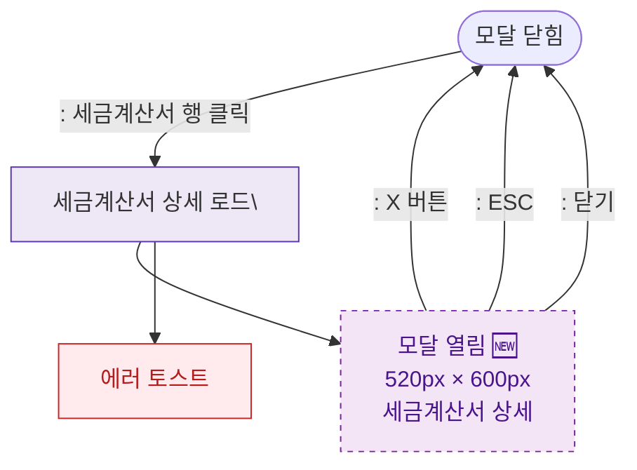

## 1. 목적
DLG-S010 세금계산서상세 모달(🆕)의 열기/닫기 생명주기를 표현한다.

## 2. 전제조건
- SCR-S010 세금계산서발행에서 행 클릭

## 3. 다이어그램

## 4. 엣지 설명

| 출발 | 도착 | 설명 | |---------|------|------|------| | | CLOSED | LOAD | 세금계산서 행 클릭 | | | LOAD | OPEN | 로드 성공 | | | LOAD | ERR_TOAST | 로드 실패 |
