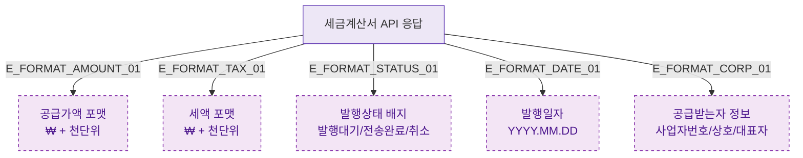

## 1. 목적
DLG-S010은 조회 전용 모달. 세금계산서 데이터 포맷 규칙을 표현한다.

## 2. 전제조건
- DLG-S010 열림 상태

## 3. 다이어그램

## 4. 엣지 설명

| 엣지 ID | 출발 | 도착 | 설명 |
|---------|------|------|------|
| E_FORMAT_AMOUNT_01 | DATA | SUPPLY | 공급가액 포맷 |
| E_FORMAT_TAX_01 | DATA | TAX | 세액 포맷 |
| E_FORMAT_STATUS_01 | DATA | STATUS | 발행상태 배지 |

## 5. TC 후보

| TC ID | 타입 | Given | When | Then |
|-------|------|-------|------|------|
| TC-S010-DLG010-M2-01 | positive | 세금계산서 데이터 | 모달 렌더링 | 공급가액/세액/상태/일자/공급받는자 정상 표시 |
