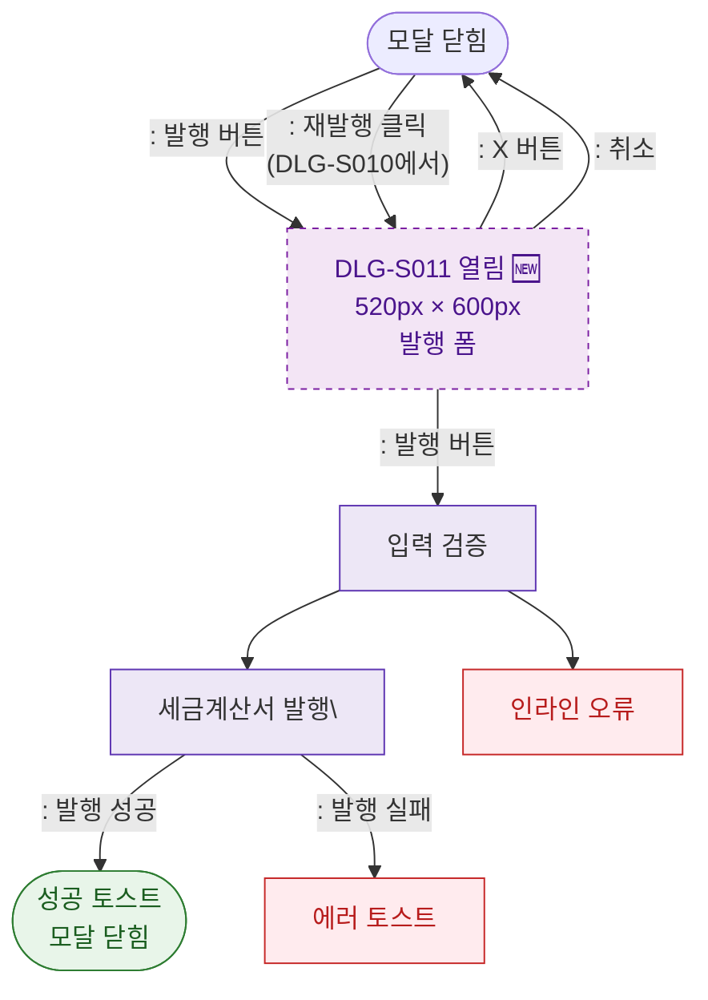

## 1. 목적
DLG-S011 세금계산서발행 모달(🆕)의 열기/닫기 생명주기를 표현한다.

## 2. 전제조건
- SCR-S010에서 발행 버튼 클릭 또는 DLG-S010에서 재발행 클릭

## 3. 다이어그램

## 4. 엣지 설명

| 출발 | 도착 | 설명 | |---------|------|------|------| | | CLOSED | OPEN | 신규 발행 버튼 | | | CLOSED | OPEN | 재발행 (DLG-S010에서) | | | OPEN | VALIDATE | 발행 버튼 클릭 | | | ISSUE | SUCCESS | 발행 성공 |
