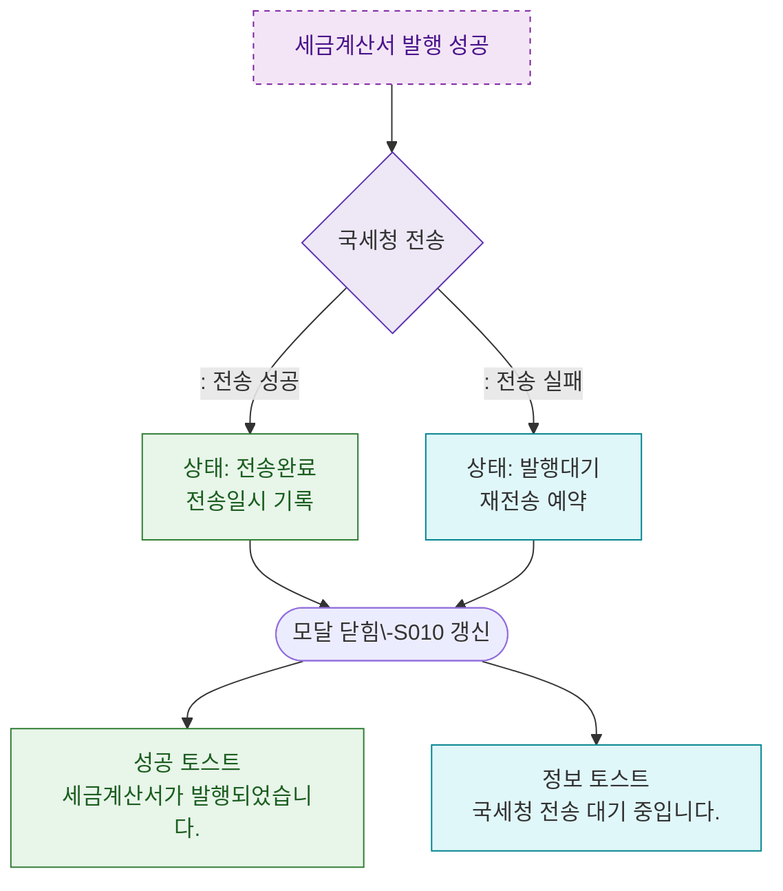

## 1. 목적
DLG-S011 발행 완료 후 국세청 전송 및 상태 갱신 분기를 표현한다.

## 2. 전제조건
- DLG-S011에서 발행 성공

## 3. 다이어그램

## 4. 엣지 설명

| 출발 | 도착 | 설명 | |---------|------|------|------| | | ISSUE_OK | NTS | 국세청 전송 시도 | | | NTS | SENT_STATUS | 전송 성공 → 완료 상태 | | | NTS | PENDING_STATUS | 전송 실패 → 대기 상태 |
