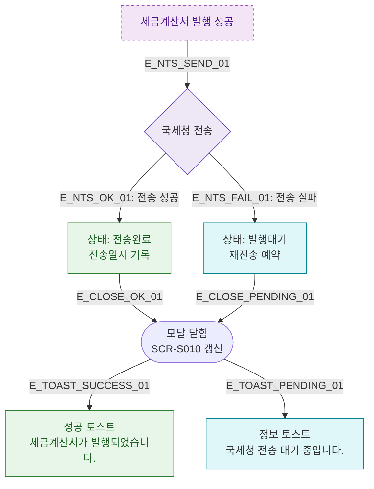

## 1. 목적
DLG-S011 발행 완료 후 국세청 전송 및 상태 갱신 분기를 표현한다.

## 2. 전제조건
- DLG-S011에서 발행 성공

## 3. 다이어그램

## 4. 엣지 설명

| 엣지 ID | 출발 | 도착 | 설명 |
|---------|------|------|------|
| E_NTS_SEND_01 | ISSUE_OK | NTS | 국세청 전송 시도 |
| E_NTS_OK_01 | NTS | SENT_STATUS | 전송 성공 → 완료 상태 |
| E_NTS_FAIL_01 | NTS | PENDING_STATUS | 전송 실패 → 대기 상태 |

## 5. TC 후보

| TC ID | 타입 | Given | When | Then |
|-------|------|-------|------|------|
| TC-S010-DLG011-M3-01 | positive | 발행 성공 | 국세청 전송 성공 | 상태 전송완료, 성공 토스트 |
| TC-S010-DLG011-M3-02 | exception | 발행 성공 | 국세청 전송 실패 | 상태 발행대기, 정보 토스트 |
