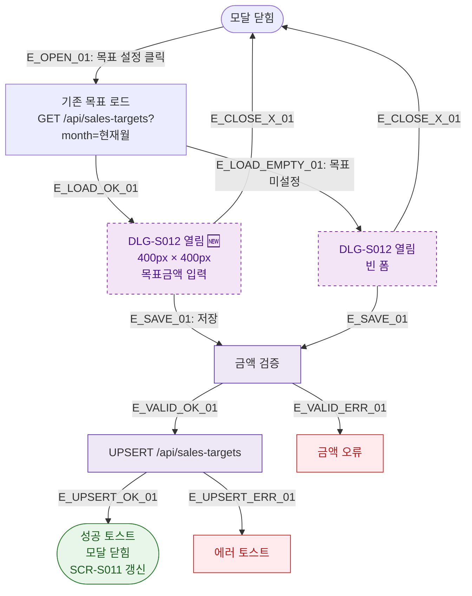

## 1. 목적
DLG-S012 목표매출설정 모달(🆕)의 열기/닫기 생명주기를 표현한다.

## 2. 전제조건
- SCR-S011 매출예측에서 목표 설정 버튼 클릭

## 3. 다이어그램

## 4. 엣지 설명

| 엣지 ID | 출발 | 도착 | 설명 |
|---------|------|------|------|
| E_OPEN_01 | CLOSED | LOAD | 목표 설정 버튼 클릭 |
| E_LOAD_OK_01 | LOAD | OPEN | 기존 목표 있음 |
| E_LOAD_EMPTY_01 | LOAD | OPEN_EMPTY | 목표 미설정 |
| E_UPSERT_OK_01 | UPSERT | SUCCESS | 저장 성공 |

## 5. TC 후보

| TC ID | 타입 | Given | When | Then |
|-------|------|-------|------|------|
| TC-S011-DLG012-M1-01 | positive | 기존 목표 있음 | 목표 설정 클릭 | DLG-S012 열림, 기존 금액 표시 |
| TC-S011-DLG012-M1-02 | positive | 목표 미설정 | 목표 설정 클릭 | DLG-S012 열림, 빈 폼 |
