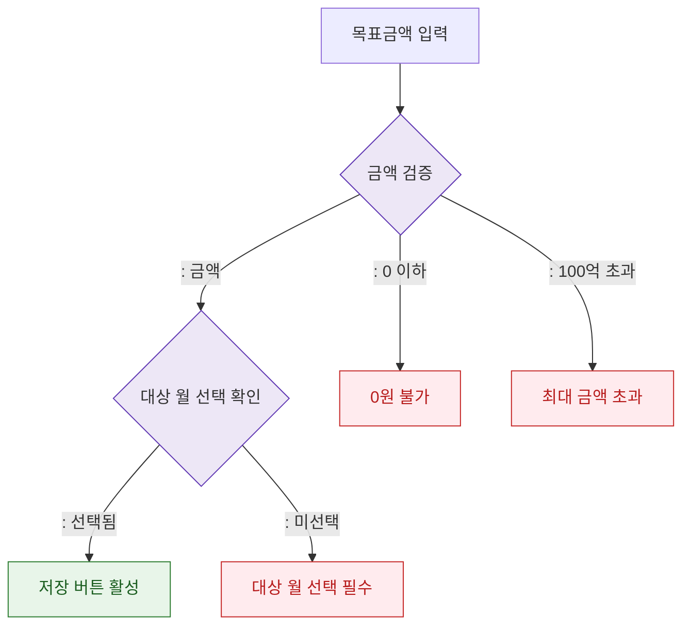

## 1. 목적
DLG-S012 목표 금액 입력 필드 검증 규칙을 표현한다.

## 2. 전제조건
- DLG-S012 열림 상태

## 3. 다이어그램

## 4. 엣지 설명

| 출발 | 도착 | 설명 | |---------|------|------|------| | | VALIDATE | MONTH_CHECK | 금액 유효 | | | VALIDATE | ERR_ZERO | 0 이하 입력 | | | VALIDATE | ERR_OVER | 100억 초과 | | | MONTH_CHECK | ERR_MONTH | 대상 월 미선택 |
