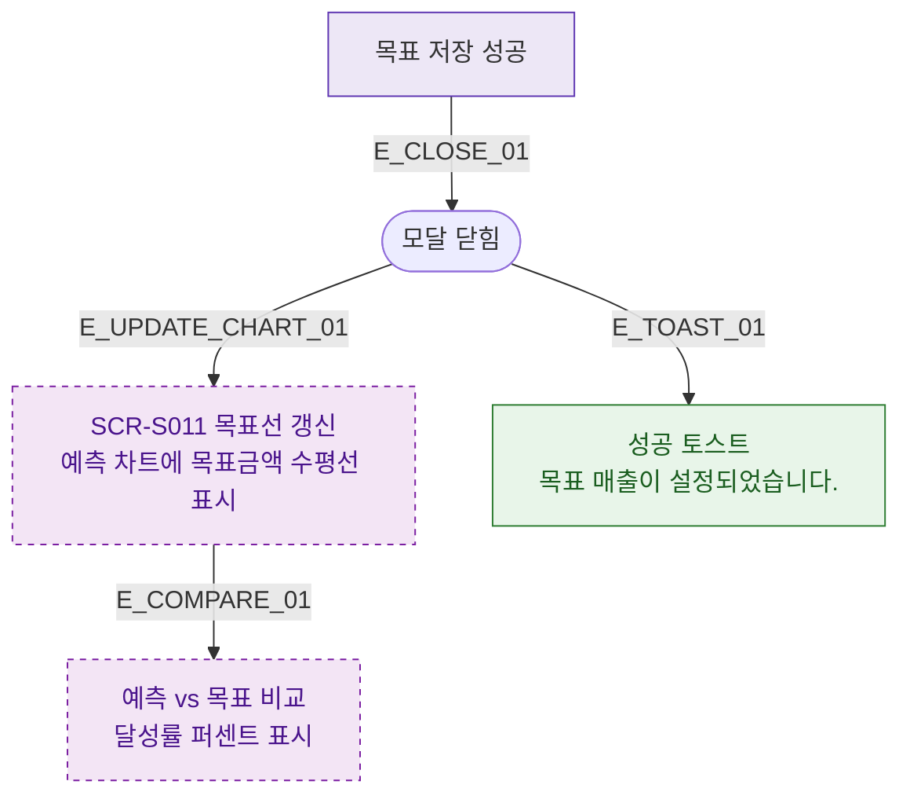

## 1. 목적
DLG-S012 저장 후 SCR-S011 예측 차트 갱신 분기를 표현한다.

## 2. 전제조건
- DLG-S012에서 저장 성공

## 3. 다이어그램

## 4. 엣지 설명

| 엣지 ID | 출발 | 도착 | 설명 |
|---------|------|------|------|
| E_CLOSE_01 | SAVE_OK | CLOSED | 저장 → 닫힘 |
| E_UPDATE_CHART_01 | CLOSED | UPDATE_CHART | 차트 목표선 갱신 |
| E_COMPARE_01 | UPDATE_CHART | COMPARE | 예측 vs 목표 비교 |

## 5. TC 후보

| TC ID | 타입 | Given | When | Then |
|-------|------|-------|------|------|
| TC-S011-DLG012-M3-01 | positive | 목표 설정 완료 | 모달 닫힘 후 | 예측 차트에 목표선 표시, 달성률 표시 |
| TC-S011-DLG012-M3-02 | positive | 기존 목표 수정 | 저장 | 차트 목표선 업데이트 |
