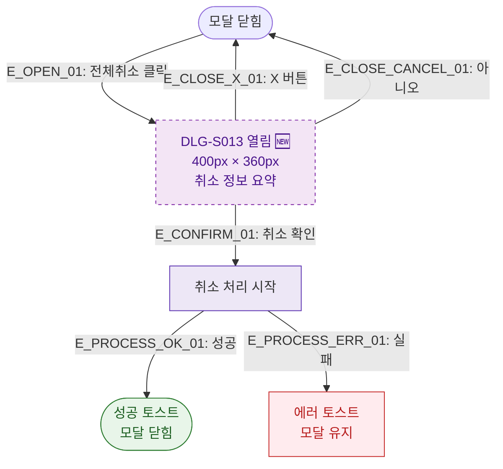

## 1. 목적
DLG-S013 환불처리(전체취소 확인) 모달(🆕)의 열기/닫기 생명주기를 표현한다.

## 2. 전제조건
- SCR-S012에서 전체취소 버튼 클릭

## 3. 다이어그램

## 4. 엣지 설명

| 엣지 ID | 출발 | 도착 | 설명 |
|---------|------|------|------|
| E_OPEN_01 | CLOSED | OPEN | 전체취소 버튼 클릭 |
| E_CONFIRM_01 | OPEN | PROCESS | 취소 확인 |
| E_CLOSE_CANCEL_01 | OPEN | CLOSED | 아니오 → 닫힘 |
| E_PROCESS_OK_01 | PROCESS | SUCCESS | 처리 성공 |
| E_PROCESS_ERR_01 | PROCESS | ERR_TOAST | 처리 실패 |

## 5. TC 후보

| TC ID | 타입 | Given | When | Then |
|-------|------|-------|------|------|
| TC-S012-DLG013-M1-01 | positive | SCR-S012 취소가능 건 | 전체취소 클릭 | DLG-S013 열림, 취소 정보 표시 |
| TC-S012-DLG013-M1-02 | positive | DLG-S013 열림 | 취소 확인 | 처리 성공, 닫힘 |
