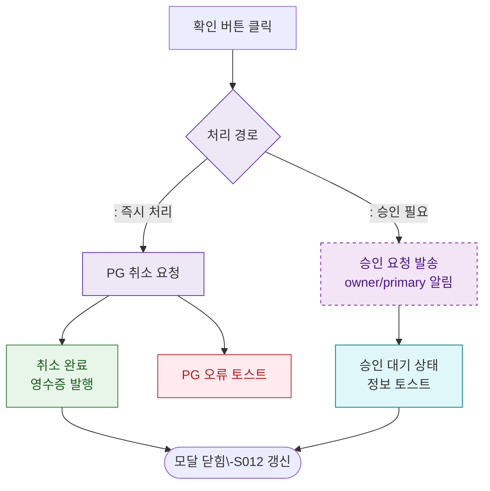

## 1. 목적
DLG-S013 확인 후 승인 요청 또는 즉시 처리 분기를 표현한다.

## 2. 전제조건
- DLG-S013에서 확인 버튼 클릭

## 3. 다이어그램

## 4. 엣지 설명

| 출발 | 도착 | 설명 | |---------|------|------|------| | | ROUTE | PG_CANCEL | 즉시 PG 취소 | | | ROUTE | SEND_APPROVAL | 승인 요청 발송 | | | PG_CANCEL | CANCEL_DONE | PG 취소 성공 | | | SEND_APPROVAL | WAIT_STATE | 승인 대기 상태 |
