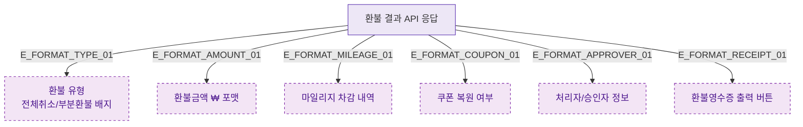

## 1. 목적
DLG-S014는 조회 전용. 환불 결과 데이터 표시 포맷을 표현한다.

## 2. 전제조건
- DLG-S014 열림 상태

## 3. 다이어그램

## 4. 엣지 설명

| 엣지 ID | 출발 | 도착 | 설명 |
|---------|------|------|------|
| E_FORMAT_TYPE_01 | DATA | REFUND_TYPE | 환불 유형 배지 |
| E_FORMAT_MILEAGE_01 | DATA | MILEAGE_INFO | 마일리지 차감 내역 |
| E_FORMAT_COUPON_01 | DATA | COUPON_INFO | 쿠폰 복원 여부 |
| E_FORMAT_RECEIPT_01 | DATA | RECEIPT_BTN | 영수증 출력 버튼 |

## 5. TC 후보

| TC ID | 타입 | Given | When | Then |
|-------|------|-------|------|------|
| TC-S012-DLG014-M2-01 | positive | 환불 결과 데이터 | 모달 렌더링 | 유형/금액/마일리지/쿠폰/처리자 정상 표시 |
