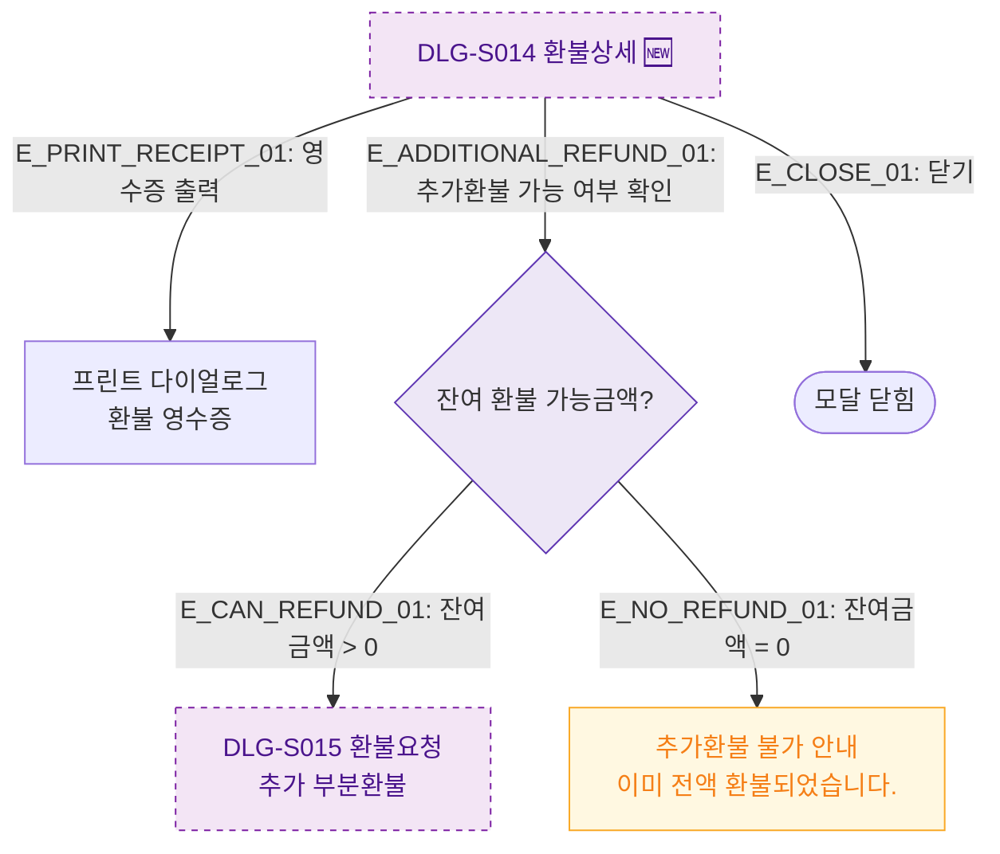

## 1. 목적
DLG-S014에서 영수증 출력 및 추가 부분환불 분기를 표현한다.

## 2. 전제조건
- DLG-S014 열림 상태 (부분환불완료 건)

## 3. 다이어그램

## 4. 엣지 설명

| 엣지 ID | 출발 | 도착 | 설명 |
|---------|------|------|------|
| E_PRINT_RECEIPT_01 | DLG_S014 | PRINT | 환불 영수증 출력 |
| E_CAN_REFUND_01 | REFUND_CHECK | DLG_S015 | 잔여금액 → 추가 부분환불 |
| E_NO_REFUND_01 | REFUND_CHECK | NO_REFUND | 전액 환불 완료 안내 |

## 5. TC 후보

| TC ID | 타입 | Given | When | Then |
|-------|------|-------|------|------|
| TC-S012-DLG014-M3-01 | positive | 부분환불 완료 건 | 추가환불 확인 | DLG-S015 표시 |
| TC-S012-DLG014-M3-02 | negative | 전액 환불 완료 건 | 추가환불 확인 | 추가환불 불가 안내 |
