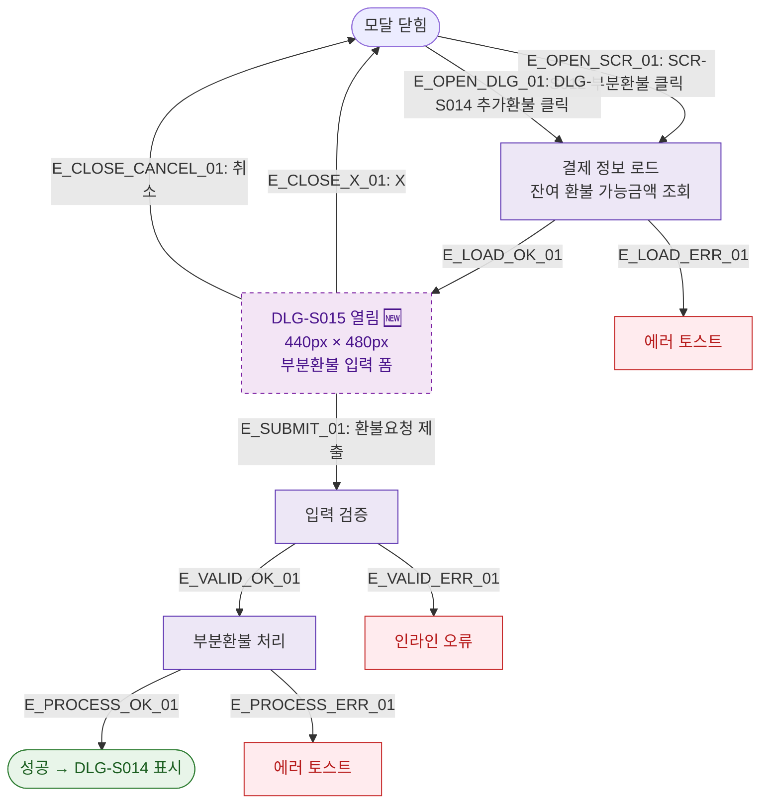

## 1. 목적
DLG-S015 부분환불 요청 모달(🆕)의 열기/닫기 생명주기를 표현한다.

## 2. 전제조건
- SCR-S012에서 부분환불 버튼 클릭
- 또는 DLG-S014에서 추가환불 클릭

## 3. 다이어그램

## 4. 엣지 설명

| 엣지 ID | 출발 | 도착 | 설명 |
|---------|------|------|------|
| E_OPEN_SCR_01 | CLOSED | LOAD | SCR-S012 진입 |
| E_OPEN_DLG_01 | CLOSED | LOAD | DLG-S014 추가환불 |
| E_SUBMIT_01 | OPEN | VALIDATE | 환불요청 제출 |
| E_PROCESS_OK_01 | PROCESS | SUCCESS | 처리 성공 → DLG-S014 |

## 5. TC 후보

| TC ID | 타입 | Given | When | Then |
|-------|------|-------|------|------|
| TC-S012-DLG015-M1-01 | positive | 취소가능 건 | 부분환불 클릭 | DLG-S015 열림, 잔여금액 표시 |
| TC-S012-DLG015-M1-02 | positive | 부분환불 완료 | 제출 | 성공, DLG-S014 표시 |
