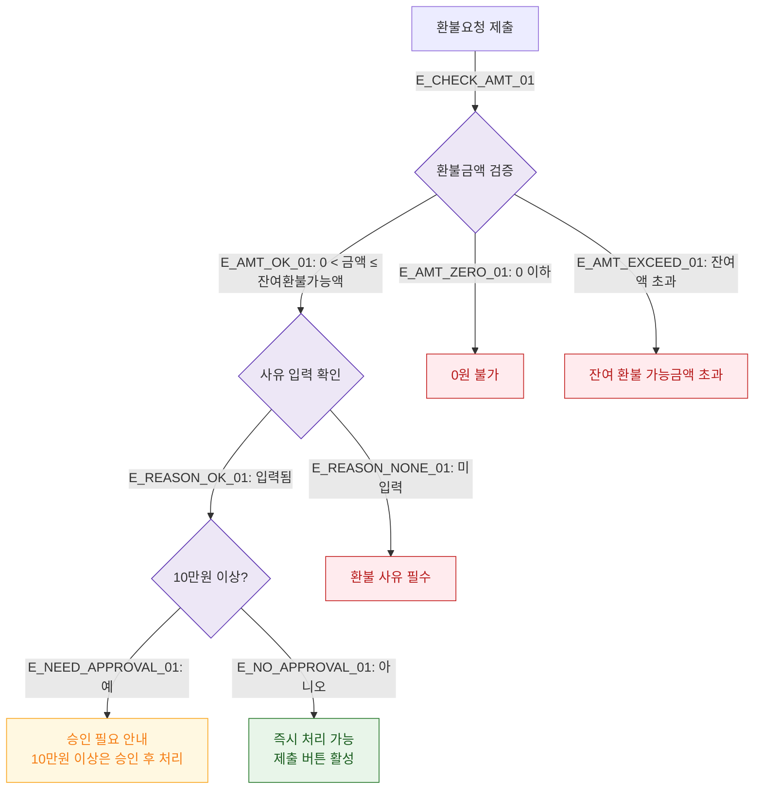

## 1. 목적
DLG-S015 부분환불 금액 및 사유 입력 필드 검증 규칙을 표현한다.

## 2. 전제조건
- DLG-S015 열림 상태

## 3. 다이어그램

## 4. 엣지 설명

| 엣지 ID | 출발 | 도착 | 설명 |
|---------|------|------|------|
| E_AMT_OK_01 | AMT_CHECK | REASON_CHECK | 금액 유효 |
| E_AMT_EXCEED_01 | AMT_CHECK | ERR_EXCEED | 잔여액 초과 |
| E_REASON_NONE_01 | REASON_CHECK | ERR_REASON | 사유 미입력 |
| E_NEED_APPROVAL_01 | APPROVAL_CHECK | APPROVAL_WARN | 10만원 이상 승인 안내 |

## 5. TC 후보

| TC ID | 타입 | Given | When | Then |
|-------|------|-------|------|------|
| TC-S012-DLG015-M2-01 | negative | 환불금액 입력 | 잔여액 초과 | 잔여액 초과 오류 |
| TC-S012-DLG015-M2-02 | negative | 사유 미입력 | 제출 버튼 | 환불 사유 필수 오류 |
| TC-S012-DLG015-M2-03 | positive | 15만원 부분환불 | 검증 | 승인 필요 안내 표시 |
